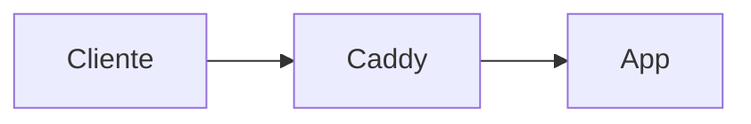

# Hermes Agent en Hetzner: laboratorio personal de proyectos 24/7

Guía paso a paso para desplegar [Hermes Agent](https://github.com/NousResearch/hermes-agent) (Nous Research) en un VPS de Hetzner, conectado a Discord y usando [OpenRouter](https://openrouter.ai/) como proveedor de modelos, con el objetivo de tener una incubadora personal de prototipos de software funcionando 24/7.

> **Documentación oficial de referencia:** <https://hermes-agent.nousresearch.com/docs>
> **Repositorio:** <https://github.com/NousResearch/hermes-agent>

> **Notas para el lector**
> - Esta guía está pensada para alguien con perfil técnico que sigue los pasos en orden.
> - Cada bloque incluye comandos copiables y, cuando aplica, una marca `📸 [images/NN-nombre.png]` donde irá una captura de pantalla.
> - Si algún paso falla, dilo: la guía se actualiza con cada bloqueo real que encontremos.

---

## Tabla de contenidos

1. [Qué es Hermes Agent y arquitectura objetivo](#1-qué-es-hermes-agent-y-arquitectura-objetivo)
2. [Elegir el VPS de Hetzner](#2-elegir-el-vps-de-hetzner)
3. [Provisionar el servidor](#3-provisionar-el-servidor)
4. [Hardening inicial: usuario, SSH y firewall](#4-hardening-inicial-usuario-ssh-y-firewall)
5. [Instalar Docker y Docker Compose](#5-instalar-docker-y-docker-compose)
6. [Instalar Hermes Agent](#6-instalar-hermes-agent)
7. [Configurar OpenRouter como proveedor](#7-configurar-openrouter-como-proveedor)
8. [Configurar varios modelos para distintas tareas](#8-configurar-varios-modelos-para-distintas-tareas)
9. [Skills de código y backend Docker para ejecución segura](#9-skills-de-código-y-backend-docker-para-ejecución-segura)
10. [Estructura de carpetas para proyectos](#10-estructura-de-carpetas-para-proyectos)
11. [Conectar Hermes con Discord](#11-conectar-hermes-con-discord)
12. [Heartbeats, cron y ejecución desatendida](#12-heartbeats-cron-y-ejecución-desatendida)
13. [Convertir Hermes en servicio systemd 24/7](#13-convertir-hermes-en-servicio-systemd-247)
14. [Despliegue de proyectos generados (Caddy + Docker)](#14-despliegue-de-proyectos-generados-caddy--docker)
15. [Documentación y artículos automáticos por proyecto](#15-documentación-y-artículos-automáticos-por-proyecto)
16. [Flujo completo de ejemplo: de idea en Discord a prototipo desplegado](#16-flujo-completo-de-ejemplo-de-idea-en-discord-a-prototipo-desplegado)
17. [Seguridad, backups y límites](#17-seguridad-backups-y-límites)
18. [Migración a producción (Sliplane, GCP, Azure)](#18-migración-a-producción-sliplane-gcp-azure)
19. [Alternativas si Hermes no encaja](#19-alternativas-si-hermes-no-encaja)
20. [Cómo convertir esto en artículo de Medium](#20-cómo-convertir-esto-en-artículo-de-medium)
21. [Checklist final](#21-checklist-final)

---

## 1. Qué es Hermes Agent y arquitectura objetivo

[Hermes Agent](https://github.com/NousResearch/hermes-agent) es un agente open-source de Nous Research (sucesor de OpenClaw) con:

- **Múltiples gateways de mensajería**: CLI, Discord, Telegram, Slack, WhatsApp, Signal, Home Assistant — todos desde un proceso `hermes gateway`.
- **Compatibilidad con cualquier proveedor OpenAI-compatible**: Nous Portal, **OpenRouter** (200+ modelos), Anthropic, OpenAI, DeepSeek directo, GLM, Kimi, Hugging Face, endpoints locales, etc.
- **Skills auto-creadas y ecosistema [agentskills.io](https://agentskills.io)**.
- **Memoria persistente** con resumen LLM y FTS5.
- **Cron scheduler integrado** para tareas autónomas (heartbeats, reports nocturnos, auditorías).
- **Backends de terminal**: local, **Docker** (sandbox), SSH, Modal, Daytona, Singularity.
- **Delegación a subagentes** con modelo distinto al principal (clave para abaratar costes).

> Refs: [README oficial](https://github.com/NousResearch/hermes-agent/blob/main/README.md), [Quickstart](https://hermes-agent.nousresearch.com/docs/getting-started/quickstart/), [Configuration](https://hermes-agent.nousresearch.com/docs/user-guide/configuration/).

### Arquitectura que vamos a montar

```
┌─────────────────────────────────────────────────────────────┐
│                      Hetzner VPS (Linux)                    │
│                                                             │
│  ┌─────────────┐   ┌──────────────────────────────────┐     │
│  │  Discord    │──▶│  hermes gateway  (systemd)       │     │
│  │  (tu cliente)│   │  ────────────────────────────── │     │
│  └─────────────┘   │  hermes core agent               │     │
│                    │   ├─ OpenRouter (DeepSeek V4 …)  │     │
│                    │   ├─ Memory (~/.hermes/data)     │     │
│                    │   ├─ Skills (~/.hermes/skills)   │     │
│                    │   └─ Cron / Heartbeats           │     │
│                    └──────┬────────────────────┬──────┘     │
│                           │ terminal.backend   │            │
│                           │ = docker           │            │
│                           ▼                    ▼            │
│   /home/hermes/projects/proyecto-A   /home/hermes/projects/proyecto-B
│   ├─ docker-compose.yml              ├─ docker-compose.yml  │
│   ├─ src/                            ├─ src/                │
│   ├─ README.md                       ├─ README.md           │
│   └─ ARTICLE.md                      └─ ARTICLE.md          │
│                                                             │
│   ┌──────────────────────────────────────────────────┐      │
│   │  Caddy (reverse proxy + HTTPS automático)        │      │
│   │  proyecto-a.tu-dominio.com → contenedor A:8080   │      │
│   │  proyecto-b.tu-dominio.com → contenedor B:3000   │      │
│   └──────────────────────────────────────────────────┘      │
└─────────────────────────────────────────────────────────────┘
```

---

## 2. Elegir el VPS de Hetzner

Precios actualizados al ajuste del **1 abril 2026** ([fuente](https://docs.hetzner.com/general/infrastructure-and-availability/price-adjustment/)). Todos los planes incluyen 20 TB de tráfico, 1 IPv4, IPv6 y firewall gratuito.

| Plan       | vCPU | RAM   | Disco  | Precio/mes | Recomendado para |
|------------|------|-------|--------|------------|------------------|
| CX22       | 2    | 4 GB  | 40 GB  | ~3,79 €    | Hermes solo, 1-2 contenedores chicos |
| **CX32**   | **4**| **8 GB**| **80 GB** | **~6,80 €** | **★ Sweet spot: Hermes + 4-6 prototipos Docker** |
| CX42       | 8    | 16 GB | 160 GB | ~16,40 €   | Si planeas correr modelos locales o muchos servicios |
| CAX21 (ARM)| 4    | 8 GB  | 80 GB  | ~6 €       | Igual que CX32 si tus stacks son ARM-friendly |

**Recomendación:** empieza con **CX32** (Ubuntu 24.04 LTS, datacenter Falkenstein o Helsinki). Es trivialmente escalable a CX42 sin reinstalar (Hetzner permite redimensionar en caliente).

> ⚠️ CX y CAX solo están en datacenters de la UE. Si necesitas EE.UU. o Singapur, usa CPX o CCX.

📸 [images/02-hetzner-plans.png] *(captura del comparador de planes)*

---

## 3. Provisionar el servidor

### 3.1. Crea la cuenta y un proyecto

1. Ve a <https://console.hetzner.cloud/> y crea cuenta. Pide validación con tarjeta o PayPal (Hetzner activa cuentas en minutos pero a veces pide ID los primeros días).
2. Crea un nuevo **Project** (ej. `Hermes`).

📸 [images/03-hetzner-project.png]

### 3.2. Sube tu clave SSH

Antes de crear el servidor genera (en tu máquina local) una clave dedicada:

```bash
ssh-keygen -t ed25519 -C "hetzner-hermes" -f ~/.ssh/hetzner_hermes
```

En la consola de Hetzner: **Security → SSH Keys → Add SSH Key**, pega el contenido de `~/.ssh/hetzner_hermes.pub`.

📸 [images/04-hetzner-ssh-key.png]

### 3.3. Crea el servidor

En la pantalla **Add Server** rellena solo lo siguiente:

| Campo | Valor | Notas |
| ----- | ----- | ----- |
| **Location** | Falkenstein (FSN1) o Helsinki (HEL1) | Cualquier datacenter UE vale |
| **Image** | Ubuntu 24.04 | LTS, soporte hasta 2029 |
| **Type** | CX32 (Shared vCPU · x86) | Pestaña "Shared vCPU" |
| **Networking → Public IPv4** | ✅ **ACTIVADO** | ~0,50 €/mes extra. **Necesario** porque muchos ISP residenciales no rutan IPv6 — sin IPv4 tu propio navegador puede no llegar a tus prototipos |
| **Networking → Public IPv6** | ✅ activado (gratis) | Déjalo activo |
| **Networking → Private networks** | (vacío) | Solo si quieres LAN entre varios servidores Hetzner |
| **SSH Keys** | ✅ tu clave del paso 3.2 | Crítico: si no marcas ninguna, Hetzner manda password por email |
| **Volumes** | (vacío) | El disco de 80 GB del CX32 ya basta |
| **Firewalls** | (vacío) | Lo creamos en el paso 4.4 |
| **Backups** | ✅ activar | +20% del precio (~1,36 €). Snapshots diarios, 7 retenciones. Recomendado |
| **Placement groups** | ❌ omitir | Solo sirve para distribuir varios servidores en hardware distinto. No aplica a 1 VPS |
| **Labels** | ❌ omitir | Tags opcionales para agrupar recursos en proyectos grandes. Innecesario aquí |
| **Cloud config / User data** | ❌ omitir | Sería un script `cloud-init` para auto-provisión. Lo hacemos a mano en el paso 4 |
| **Name** | `hermes-lab` | |

Pulsa **Create & Buy now**.

📸 [images/05-hetzner-create-server.png]

Anota la **IP pública IPv4** que aparece tras unos segundos (la usaremos como `SERVER_IP`).

### 3.4. Primer login

Desde tu máquina local:

```bash
ssh -i ~/.ssh/hetzner_hermes root@SERVER_IP
```

Acepta la huella. Si entra, todo bien.

---

## 4. Hardening inicial: usuario, SSH y firewall

### 4.1. Actualiza el sistema e instala dependencias base

Estos paquetes son **dependencias del sistema operativo**, no de Hermes. Cubren tres cosas: seguridad, parcheo automático y herramientas comunes que Docker y otros instaladores asumen.

```bash
apt update && apt upgrade -y
apt install -y ufw fail2ban unattended-upgrades curl git build-essential ca-certificates gnupg lsb-release htop
dpkg-reconfigure -plow unattended-upgrades   # acepta los defaults
```

**Qué hace cada paquete y por qué lo necesitas:**

| Paquete | Para qué sirve | ¿Imprescindible? |
| ------- | -------------- | ---------------- |
| `ufw` | Firewall a nivel de host (paso 4.4) | Sí |
| `fail2ban` | Banea IPs tras N intentos fallidos de SSH (paso 4.5) | Sí |
| `unattended-upgrades` | Aplica parches de seguridad automáticamente sin tocar nada | Sí (lab 24/7) |
| `curl` | Descarga el instalador de Hermes y la GPG key de Docker | Sí |
| `git` | **Única dependencia "manual" que Hermes pide explícitamente.** El resto las gestiona el `install.sh` | Sí |
| `build-essential` | gcc/make: necesario si alguna skill compila código nativo | Recomendado |
| `ca-certificates` | Certificados raíz para HTTPS (Docker repo, OpenRouter) | Sí |
| `gnupg`, `lsb-release` | Verificar firmas y detectar versión Ubuntu (Docker repo) | Sí |
| `htop` | Monitor interactivo de procesos | Comodidad |

#### ¿Y las dependencias de Hermes en sí?

**No instales Python, Node, uv, ripgrep ni ffmpeg manualmente.** El instalador oficial (`scripts/install.sh`, paso 6) los provisiona en un entorno aislado para evitar choques con paquetes del sistema. Concretamente, según la [docu oficial de instalación](https://hermes-agent.nousresearch.com/docs/getting-started/installation):

- **uv** (gestor de paquetes Python ultrarrápido)
- **Python 3.11** dentro de un venv aislado
- **Node.js v22** (necesario para skills basadas en npm y para `agent-browser` del paso 9.4)
- **ripgrep** (búsquedas FTS en código)
- **ffmpeg** (conversión de audio para voice mode)

Para diagnosticar o reparar dependencias después de la instalación, usa:

```bash
hermes doctor       # diagnóstico completo (te dice qué falta y cómo arreglarlo)
hermes update       # vuelve a tirar del install.sh y actualiza todo
```

> Hermes **no** tiene un comando `hermes deps install` separado: la gestión de dependencias está incorporada en el propio `install.sh` y en `hermes update`. Refs: [Installation](https://hermes-agent.nousresearch.com/docs/getting-started/installation), [CLI Reference](https://hermes-agent.nousresearch.com/docs/reference/cli-commands).

### 4.2. Crea un usuario no-root para Hermes

Hermes debe vivir en su propio usuario (no root) para limitar daño en caso de RCE accidental.

```bash
adduser --disabled-password --gecos "" hermes
usermod -aG sudo hermes
mkdir -p /home/hermes/.ssh
cp /root/.ssh/authorized_keys /home/hermes/.ssh/
chown -R hermes:hermes /home/hermes/.ssh
chmod 700 /home/hermes/.ssh
chmod 600 /home/hermes/.ssh/authorized_keys
```

Concede sudo sin password (cómodo para automatizaciones; si prefieres con password, salta este bloque):

```bash
echo "hermes ALL=(ALL) NOPASSWD:ALL" > /etc/sudoers.d/hermes
chmod 440 /etc/sudoers.d/hermes
```

### 4.3. Endurece SSH

Edita `/etc/ssh/sshd_config.d/99-hardening.conf`:

```bash
cat > /etc/ssh/sshd_config.d/99-hardening.conf <<'EOF'
PermitRootLogin no
PasswordAuthentication no
PubkeyAuthentication yes
KbdInteractiveAuthentication no
ChallengeResponseAuthentication no
MaxAuthTries 3
LoginGraceTime 20
AllowUsers hermes
EOF

systemctl restart ssh
```

> **No cierres la sesión todavía.** En otra terminal verifica que puedes entrar como `hermes`:
> ```bash
> ssh -i ~/.ssh/hetzner_hermes hermes@SERVER_IP
> ```
> Si funciona, ya puedes cerrar la sesión root.

### 4.4. Firewall (UFW + Hetzner Cloud Firewall)

**Doble capa**: UFW dentro del VPS + Cloud Firewall en el panel.

UFW dentro:
```bash
ufw default deny incoming
ufw default allow outgoing
ufw allow 22/tcp
ufw allow 80/tcp
ufw allow 443/tcp
ufw --force enable
ufw status verbose
```

Cloud Firewall (Hetzner panel → **Firewalls → Create Firewall**):

| Direction | Protocol | Port  | Source        |
|-----------|----------|-------|---------------|
| Inbound   | TCP      | 22    | (tu IP/32 si es fija; en otro caso `0.0.0.0/0`) |
| Inbound   | TCP      | 80    | 0.0.0.0/0     |
| Inbound   | TCP      | 443   | 0.0.0.0/0     |

Aplica la firewall al servidor `hermes-lab`.

📸 [images/06-hetzner-firewall.png]

> No abras puertos de aplicaciones (3000, 8080, etc.). Caddy hará el reverse proxy en 80/443.

### 4.5. Fail2ban

Activa la jail por defecto para SSH:

```bash
systemctl enable --now fail2ban
fail2ban-client status sshd
```

---

## 5. Instalar Docker y Docker Compose

A partir de aquí trabaja como `hermes` (`ssh hermes@SERVER_IP`). Instala Docker oficial:

```bash
sudo install -m 0755 -d /etc/apt/keyrings
curl -fsSL https://download.docker.com/linux/ubuntu/gpg | sudo gpg --dearmor -o /etc/apt/keyrings/docker.gpg
sudo chmod a+r /etc/apt/keyrings/docker.gpg

echo "deb [arch=$(dpkg --print-architecture) signed-by=/etc/apt/keyrings/docker.gpg] \
  https://download.docker.com/linux/ubuntu $(. /etc/os-release && echo "$VERSION_CODENAME") stable" | \
  sudo tee /etc/apt/sources.list.d/docker.list > /dev/null

sudo apt update
sudo apt install -y docker-ce docker-ce-cli containerd.io docker-buildx-plugin docker-compose-plugin

sudo usermod -aG docker hermes
# cierra y vuelve a abrir la sesión SSH para que el grupo se aplique
```

Verifica:

```bash
docker run --rm hello-world
docker compose version
```

---

## 6. Instalar Hermes Agent

Como usuario `hermes`:

```bash
curl -fsSL https://raw.githubusercontent.com/NousResearch/hermes-agent/main/scripts/install.sh | bash
source ~/.bashrc
hermes --version
```

> El instalador soporta Linux/macOS/WSL2/Termux. Crea `~/.hermes/`, instala dependencias Python en un venv aislado y añade `hermes` al PATH. Refs: [Quickstart](https://hermes-agent.nousresearch.com/docs/getting-started/quickstart/).

Estructura post-install:

```
~/.hermes/
├── config.yaml      # configuración no-secreta (editable a mano)
├── .env             # API keys y secretos (chmod 600)
├── data/            # memoria, sesiones, FTS5
├── skills/          # skills instaladas
├── cron/            # jobs programados
└── logs/
```

Comprueba que todo está sano:

```bash
hermes doctor
```

---

## 7. Configurar OpenRouter como proveedor

### 7.1. Saca una API key de OpenRouter

1. Crea cuenta en <https://openrouter.ai/>.
2. **Settings → Keys → Create Key**, dale nombre `hermes-hetzner`, **opcional**: pon un límite de gasto mensual (recomendado: empieza en 20–30 $).
3. Copia la key (empieza por `sk-or-v1-…`).

📸 [images/07-openrouter-key.png]

### 7.2. Carga la key en Hermes

```bash
hermes config set OPENROUTER_API_KEY sk-or-v1-XXXXXXXXXXXXXXXXXXXXXXXX
```

> Hermes coloca el secreto automáticamente en `~/.hermes/.env` (no en `config.yaml`). Si prefieres editar a mano: `chmod 600 ~/.hermes/.env` y añade `OPENROUTER_API_KEY=...`.
>
> Ref: [Configure LLM API Keys](https://hermes-agent.ai/blog/hermes-agent-api-keys), [Providers](https://hermes-agent.nousresearch.com/docs/integrations/providers).

### 7.3. Selecciona el proveedor

```bash
hermes model
```

Elige `openrouter` y, como modelo principal, `deepseek/deepseek-v4-pro`. (En el siguiente paso ajustaremos esto en `config.yaml`).

---

## 8. Configurar varios modelos para distintas tareas

Hermes permite tres "ranuras" útiles ([docs](https://hermes-agent.nousresearch.com/docs/user-guide/configuration/)):

- **`model`**: el modelo principal (decisiones, código, arquitectura).
- **`delegation`**: el modelo que reciben los **subagentes** spawneados (debugging, búsquedas, refactors localizados). Suele ser un modelo barato y rápido.
- **`auxiliary`**: tareas auxiliares (resumen web, vision, MoA). Por defecto Gemini Flash.

### 8.1. Recomendación de modelos en OpenRouter (abril 2026)

| Rol | Modelo | Coste $/Mtok in/out | Por qué |
|-----|--------|---------------------|---------|
| **Principal (coding/arquitectura)** | `deepseek/deepseek-v4-pro` | 1.74 / 3.48 | 80.6% en SWE-bench Verified, 1M ctx, ~7× más barato que Claude Opus |
| **Delegation / chats / compaction** | `deepseek/deepseek-v4-flash` | ~0.30 / 0.60 (aprox.) | MoE eficiente, 1M ctx, ideal para subagentes |
| **Backup barato** | `deepseek/deepseek-v3.2` | 0.25 / 0.38 | Si V4 está caído o quieres apretar costes |
| **Auxiliary (vision/web summary)** | `google/gemini-3-flash-preview` | bajo | Default Hermes, multimodal |
| **Reasoning fuerte (opcional)** | `anthropic/claude-sonnet-4-6` o `openai/gpt-5-codex` | varía | Cuando V4-Pro se queda corto en lógica densa |

> Ref pricing/modelos: [OpenRouter DeepSeek V4 Pro](https://openrouter.ai/deepseek/deepseek-v4-pro), [OpenRouter DeepSeek V4 Flash](https://openrouter.ai/deepseek/deepseek-v4-flash), [DeepSeek V3.2](https://openrouter.ai/deepseek/deepseek-v3.2).

### 8.2. Edita `~/.hermes/config.yaml`

```bash
nano ~/.hermes/config.yaml
```

Añade/ajusta estas secciones (deja el resto del archivo como esté):

```yaml
model:
  provider: openrouter
  default: deepseek/deepseek-v4-pro
  fallback_model: deepseek/deepseek-v3.2

provider_routing:
  sort: throughput        # price | throughput | latency
  require_parameters: true
  data_collection: deny   # privacidad: rechaza providers que loggean

delegation:
  provider: openrouter
  model: deepseek/deepseek-v4-flash
  max_concurrent_children: 3
  max_spawn_depth: 2
  orchestrator_enabled: true

auxiliary:
  provider: openrouter
  model: google/gemini-3-flash-preview

agent:
  max_turns: 90

compression:
  enabled: true
  threshold: 0.50
  target_ratio: 0.20

timezone: "Europe/Madrid"
```

### 8.3. Cambiar de modelo en caliente

Desde Discord o CLI:

```
/model openrouter:deepseek/deepseek-v4-pro
/model openrouter:anthropic/claude-sonnet-4-6
```

> Sufijos útiles: `:nitro` (sort throughput), `:floor` (sort price). Ej: `deepseek/deepseek-v4-flash:floor`.

---

## 9. Skills de código y backend Docker para ejecución segura

### 9.1. Activa el backend Docker

Esto hace que **todos los comandos que Hermes ejecute** (incluido `git`, `python`, `npm`, etc.) corran dentro de un contenedor sandbox, no directamente en el host.

```yaml
# añade/edita en ~/.hermes/config.yaml
terminal:
  backend: docker
  docker_image: nikolaik/python-nodejs:python3.11-nodejs20
  docker_mount_cwd_to_workspace: true
  docker_volumes:
    - "/home/hermes/projects:/workspace/projects"
  docker_forward_env:
    - GITHUB_TOKEN
    - OPENROUTER_API_KEY
  container_cpu: 2
  container_memory: 4096
  container_persistent: true

code_execution:
  mode: project
  timeout: 300
  max_tool_calls: 50
```

> Ref: [Configuration → Terminal Backends](https://hermes-agent.nousresearch.com/docs/user-guide/configuration/).

### 9.2. Skills útiles para programar

```bash
hermes skills list --remote      # ver catálogo agentskills.io
hermes skills install coder      # skill genérica de coding
hermes skills install git-flow
hermes skills install docker-deploy
hermes skills install testing
```

Después:

```bash
hermes skills list               # confirma que están instaladas
```

### 9.3. Aprobaciones automáticas (modo off)

Como **todos los comandos se ejecutan dentro del contenedor Docker** del paso 9.1 y el host está aislado, puedes apagar las aprobaciones por completo. Esto permite que Hermes trabaje 100 % desatendido desde Discord sin pedirte confirmación cuando lanza `npm install`, `docker compose up`, `git push`, etc.

```yaml
# en ~/.hermes/config.yaml
approvals:
  mode: off             # manual | smart | off  ← off = sin confirmación
security:
  redact_secrets: true  # nunca envía secretos al modelo
  tirith_enabled: true  # análisis estático de comandos peligrosos
  tirith_timeout: 5
  tirith_fail_open: true
```

**Por qué es razonable hacerlo aquí:**

- El sandbox Docker (`terminal.backend: docker`) impide tocar el host directamente.
- `tirith_enabled: true` aplica análisis estático antes de ejecutar y bloquea patrones obviamente destructivos (p.ej. `rm -rf /`).
- `redact_secrets` enmascara `.env`, tokens y keys antes de enviar al LLM, así no se filtran al historial de OpenRouter.
- `DISCORD_ALLOWED_USERS` ya restringe quién puede dar órdenes al agente.
- Hetzner hace snapshot diario (paso 3.3) y `restic` offsite (paso 17.2): si algo se rompe, restauras.

> Si en algún momento prefieres volver a confirmaciones, cambia a `mode: smart` (Hermes pregunta solo en lo destructivo, usando el modelo auxiliar) o `mode: manual` (todo confirmado). Ref: [Configuration → Security & Approvals](https://hermes-agent.nousresearch.com/docs/user-guide/configuration/).

### 9.4. Navegador local con Chromium (sin servicios externos)

Hermes puede navegar la web (scrapear docs, leer dashboards, hacer login en webs, sacar screenshots, etc.) usando **Chromium en local**, sin pagar Browserbase, Browser Use ni Firecrawl. Es lo que recomienda la [documentación oficial del navegador](https://hermes-agent.nousresearch.com/docs/user-guide/features/browser): si no defines credenciales cloud, Hermes cae automáticamente en modo local con `agent-browser` + Chromium headless.

#### 9.4.1. Instala `agent-browser` y Chromium

`agent-browser` es el wrapper Node que Hermes usa para hablar con Chromium vía CDP. Está en npm.

```bash
# instalar agent-browser globalmente (Node 22 ya está instalado por hermes install.sh)
npm install -g agent-browser

# descargar Chromium (Chrome for Testing, canal oficial de Google para automatización)
agent-browser install
```

Si `agent-browser install` no instala Chromium en algunos VPS minimalistas (Ubuntu cloud-init suele venir muy pelado), instala el binario y las librerías compartidas vía Playwright como fallback:

```bash
npx playwright install chromium
sudo npx playwright install-deps chromium     # instala libnss3, libatk, libdrm, libxkbcommon, etc.
```

> El paso `install-deps` mete ~30 paquetes apt necesarios para Chromium headless (fuentes, GTK, NSS, etc.). Sin ellos, el navegador se cae al primer `page.goto()`.

#### 9.4.2. Activa el toolset `browser` en Hermes

```bash
hermes config set toolsets '["hermes-cli", "browser"]'
```

O directamente en `~/.hermes/config.yaml`:

```yaml
toolsets:
  - hermes-cli
  - browser

browser:
  cloud_provider: ""          # vacío = modo local (default si no hay creds cloud)
  inactivity_timeout: 300     # segundos antes de cerrar sesión idle
  command_timeout: 30000      # ms para acciones individuales (navigate, screenshot…)
  # cdp_url: ""               # solo si quisieras conectar a un Chrome ya abierto
```

#### 9.4.3. Confirma que NO usa servicios externos

Asegúrate de que en `~/.hermes/.env` **NO** existen estas variables (cualquiera de ellas activa un proveedor cloud y desactiva el modo local):

```bash
grep -E '^(BROWSERBASE_API_KEY|BROWSER_USE_API_KEY|FIRECRAWL_API_KEY|BROWSER_CDP_URL|CAMOFOX_URL)=' ~/.hermes/.env
# salida esperada: vacía
```

Según la [docu](https://hermes-agent.nousresearch.com/docs/user-guide/features/browser), si están definidas, Browserbase tiene prioridad sobre todas; Browser Use, sobre Firecrawl; etc. Sin ninguna de ellas, Hermes usa la instalación local que acabas de instalar.

#### 9.4.4. Consideraciones de recursos en CX32

- Chromium pesa ~200 MB en disco.
- Cada contexto de navegador consume **100–200 MB de RAM**.
- Si Hermes spawne 3 subagentes paralelos con browser, cuenta con ~600 MB extra de RAM ocupada.
- En un CX32 (8 GB) cabe sin problema. Si vas con CX22 (4 GB), limita la concurrencia: en `delegation:` baja `max_concurrent_children: 1`.

#### 9.4.5. Importante: si ejecutas Hermes con `terminal.backend: docker`

El sandbox del paso 9.1 corre `nikolaik/python-nodejs:python3.11-nodejs20`, que **no incluye Chromium ni sus libs**. Tienes dos opciones:

**Opción A (más simple):** que el navegador viva en el host y Hermes lo invoque desde dentro del contenedor mediante CDP. En `~/.hermes/.env`:

```bash
BROWSER_CDP_URL=ws://host.docker.internal:9222
```

Y arranca Chromium una vez en el host (lo gestiona `agent-browser` automáticamente cuando se llama).

**Opción B (más limpia):** sustituye la imagen Docker por una que ya traiga navegador + libs:

```yaml
terminal:
  backend: docker
  docker_image: mcr.microsoft.com/playwright:v1.50.0-noble  # Playwright oficial con Chromium
  shm_size: 1g    # Chromium necesita /dev/shm > 64MB para no crashear
```

> Si optas por B, recuerda añadir `--shm-size=1g` también al `docker run` que Hermes usa, vía el flag `shm_size` en config.

#### 9.4.6. Pruébalo desde Discord

```
@Hermes Lab abre https://news.ycombinator.com y dame los 5 títulos más votados de la portada
```

Si la primera vez tarda ~10 s extra es Chromium calentando. Las siguientes son inmediatas mientras la sesión esté viva (`inactivity_timeout: 300`).

---

## 10. Estructura de carpetas para proyectos

Vamos a establecer una convención que Hermes respetará vía `MESSAGING_CWD`.

```bash
mkdir -p /home/hermes/projects
mkdir -p /home/hermes/lab/templates
mkdir -p /home/hermes/lab/articles
```

Estructura recomendada por proyecto:

```
/home/hermes/projects/<slug-proyecto>/
├── docker-compose.yml         # despliegue del prototipo
├── Dockerfile                 # imagen del servicio
├── src/                       # código
├── tests/
├── README.md                  # docs auto-generadas por Hermes
├── ARTICLE.md                 # borrador de artículo de blog/Medium
├── CHANGELOG.md
├── .env.example
└── .hermes/                   # notas del agente para futuras sesiones
    ├── decisions.md
    └── todo.md
```

Configura el cwd por defecto cuando Hermes recibe mensajes:

```bash
echo 'MESSAGING_CWD=/home/hermes/projects' >> ~/.hermes/.env
echo 'TERMINAL_CWD=/workspace/projects' >> ~/.hermes/.env
```

Crea una **plantilla cookiecutter-style** que el agente clonará al iniciar cada proyecto:

```bash
mkdir -p /home/hermes/lab/templates/web-app
cat > /home/hermes/lab/templates/web-app/docker-compose.yml <<'EOF'
services:
  app:
    build: .
    restart: unless-stopped
    networks: [caddy_net]
    labels:
      caddy: "{{SLUG}}.{{DOMAIN}}"
      caddy.reverse_proxy: "{{HOSTNAME}} {{PORT}}"

networks:
  caddy_net:
    external: true
EOF
```

(Ajusta cuando definamos Caddy en el paso 14.)

---

## 11. Conectar Hermes con Discord

Sigue [docs/user-guide/messaging/discord](https://hermes-agent.nousresearch.com/docs/user-guide/messaging/discord).

### 11.1. Crea la app y el bot

1. Entra en <https://discord.com/developers/applications> → **New Application** → nombre `Hermes Lab`.
2. Pestaña **Bot**:
   - **Public Bot**: ON.
   - **Privileged Gateway Intents**:
     - ✅ **Message Content Intent** (obligatorio para que el bot lea texto).
     - ✅ **Server Members Intent** (necesario si usarás `DISCORD_ALLOWED_ROLES`).
3. **Reset Token** → copia el token (solo se muestra una vez).

📸 [images/11-discord-bot-intents.png]

### 11.2. Genera el invite link

Pestaña **Installation → Guild Install → Discord Provided Link**, scopes:
- `bot`
- `applications.commands`

Permisos mínimos:
- View Channels
- Send Messages
- Embed Links
- Attach Files
- Read Message History

Copia el link generado, ábrelo, escoge tu servidor, autoriza.

📸 [images/12-discord-invite.png]

### 11.3. Saca tu Discord User ID

Discord → **Settings → Advanced → Developer Mode ON** → click derecho sobre tu nombre → **Copy User ID**.

### 11.4. Configura Hermes

Opción interactiva:
```bash
hermes gateway setup
```
Selecciona Discord, pega bot token y user ID.

Opción manual (`~/.hermes/.env`, `chmod 600`):
```
DISCORD_BOT_TOKEN=MTAwOTk...tu-token-completo
DISCORD_ALLOWED_USERS=284102345871466496
DISCORD_REQUIRE_MENTION=true
DISCORD_AUTO_THREAD=true
```

(Opcional, en `config.yaml`):
```yaml
discord:
  require_mention: true
  free_response_channels: ""        # canales donde responde sin @mención
  auto_thread: true
group_sessions_per_user: true       # cada usuario tiene su contexto en canales compartidos
unauthorized_dm_behavior: ignore    # ignore | pair
```

### 11.5. Lanza el gateway

```bash
hermes gateway
```

A los pocos segundos el bot aparece online en tu servidor. Pruébalo:

> @Hermes Lab hola, dime tu modelo actual

Debería responder y, si miras los logs (`hermes logs gateway`), verás los eventos.

📸 [images/13-discord-first-message.png]

> Cuando confirmes que funciona, **ctrl+C**: lo convertiremos en servicio en el paso 13.

---

## 12. Heartbeats, cron y ejecución desatendida

Hermes tiene **cron scheduler integrado** para ejecutar prompts en background y entregar resultados a cualquier plataforma (Discord, Telegram, archivo, etc.).

### 12.1. Crear un job programado

```bash
hermes cron add "every 6 hours" \
  --prompt "Revisa /home/hermes/projects, cierra TODOs completados, actualiza README de cada proyecto y manda un resumen al canal #lab-status de Discord." \
  --deliver discord:#lab-status \
  --name maintenance-heartbeat
```

Otro ejemplo (artículo diario):

```bash
hermes cron add "0 22 * * *" \
  --prompt "Elige el proyecto con más cambios hoy y redacta un borrador de artículo Medium en su ARTICLE.md siguiendo el template /home/hermes/lab/templates/article.md" \
  --name daily-article
```

Lista y gestiona:

```bash
hermes cron list
hermes cron disable maintenance-heartbeat
hermes cron tick   # forzar una ejecución manual para testear
```

> Refs: cron / scheduler en [docs/user-guide/configuration](https://hermes-agent.nousresearch.com/docs/user-guide/configuration/) y [docs/reference/cli-commands](https://hermes-agent.nousresearch.com/docs/reference/cli-commands).

### 12.2. Heartbeat manual con `quick_commands`

Para checks instantáneos sin gastar tokens:

```yaml
# en ~/.hermes/config.yaml
quick_commands:
  status:
    type: exec
    command: "systemctl status hermes-gateway --no-pager | head -20"
  disk:
    type: exec
    command: "df -h /"
  containers:
    type: exec
    command: "docker ps --format '{{.Names}}\t{{.Status}}'"
```

Desde Discord: `/status`, `/disk`, `/containers` se resuelven sin llamar al modelo.

---

## 13. Convertir Hermes en servicio systemd 24/7

Crea como **root** (con `sudo`):

```bash
sudo tee /etc/systemd/system/hermes-gateway.service > /dev/null <<'EOF'
[Unit]
Description=Hermes Agent - Messaging Gateway
After=network-online.target docker.service
Wants=network-online.target

[Service]
Type=simple
User=hermes
Group=hermes
WorkingDirectory=/home/hermes
Environment="PATH=/home/hermes/.local/bin:/usr/local/bin:/usr/bin:/bin"
ExecStart=/home/hermes/.local/bin/hermes gateway
Restart=on-failure
RestartSec=10
StandardOutput=append:/home/hermes/.hermes/logs/gateway.log
StandardError=append:/home/hermes/.hermes/logs/gateway.err

# Hardening
NoNewPrivileges=true
PrivateTmp=true
ProtectSystem=full
ProtectHome=false
ReadWritePaths=/home/hermes

[Install]
WantedBy=multi-user.target
EOF

sudo systemctl daemon-reload
sudo systemctl enable --now hermes-gateway
sudo systemctl status hermes-gateway
```

> Si la ruta de `hermes` no es `/home/hermes/.local/bin/hermes`, comprueba con `which hermes` y ajusta `ExecStart`.

Repite con un servicio paralelo para el cron scheduler si así está separado en tu versión:

```bash
hermes cron --help     # comprueba si hay un subcomando 'serve' o 'daemon'
```

A día de hoy `hermes gateway` ya levanta el cron en el mismo proceso, pero verifica con `hermes status`.

Logs:
```bash
journalctl -u hermes-gateway -f
tail -f ~/.hermes/logs/gateway.log
```

---

## 14. Despliegue de proyectos generados (Caddy + Docker)

Vamos a montar **Caddy** como reverse proxy con HTTPS automático (Let's Encrypt) para que cada prototipo sea accesible vía `https://<slug>.tu-dominio.com`.

### ¿Por qué Caddy y no Nginx?

Ambos son excelentes; cumplen la misma función (reverse proxy + TLS). Para este caso de uso **Caddy gana por encaje**, no por rendimiento crudo:

| Criterio | Caddy (con `caddy-docker-proxy`) | Nginx |
| -------- | -------------------------------- | ----- |
| **HTTPS** | Let's Encrypt **automático**, sin tocar nada | Hay que montar `certbot` + cron de renovación + bloque `server` por host |
| **Añadir un nuevo proyecto** | Pegas `labels: caddy: foo.lab.dom` en el `docker-compose.yml` y listo. **Caddy detecta el contenedor y emite el cert**. | Editas un nuevo bloque `server { … }`, recargas `nginx -s reload`, lanzas `certbot` |
| **Hermes haciendo deploys autónomos** | El agente solo escribe el compose con labels. Cero entendimiento de la config del proxy | El agente tendría que editar `/etc/nginx/conf.d/*.conf` y rezar para no romper otros sites |
| **HTTP/3, OCSP stapling, HSTS** | Activos por defecto | Configuración manual |
| **Config file** | 1 archivo (o etiquetas Docker, en nuestro caso 0) | Por convención: 1 archivo por sitio |
| **Rendimiento bruto** | Suficiente sobrado para un lab. Diferencia con Nginx: irrelevante a este tráfico | Marginalmente más rápido en benchmarks de millones de req/s |
| **Memoria** | ~30 MB por proceso | ~10 MB |
| **Curva de aprendizaje** | Casi cero | Mayor (sintaxis, contextos, locations…) |

**Resumen:** elegimos Caddy porque cada vez que Hermes genera un nuevo prototipo, basta con que añada 2 líneas de etiquetas al `docker-compose.yml` y el subdominio funciona en HTTPS sin más intervención humana ni del agente. Con Nginx, cada deploy implicaría editar configuración del proxy, lo que añade puntos de fallo.

> **Si prefieres Nginx**, la alternativa más cercana es [`nginx-proxy/nginx-proxy`](https://github.com/nginx-proxy/nginx-proxy) + [`acme-companion`](https://github.com/nginx-proxy/acme-companion). Funciona también con etiquetas (`VIRTUAL_HOST=foo.lab.dom`), pero son dos contenedores en vez de uno y la experiencia no llega a la pulcritud de Caddy. Si lo eliges, sustituye los pasos 14.2-14.4; la lógica de la guía es idéntica.

### 14.1. Compra/configura un dominio

Apunta un wildcard `*.lab.tu-dominio.com` (registro `A`) a la IP del VPS. Cualquier registrar (Namecheap, Cloudflare, OVH).

### 14.2. Red Docker compartida

```bash
docker network create caddy_net
```

### 14.3. Caddy con plugin Docker

```bash
mkdir -p /home/hermes/infra/caddy
cd /home/hermes/infra/caddy
cat > docker-compose.yml <<'EOF'
services:
  caddy:
    image: lucaslorentz/caddy-docker-proxy:ci-alpine
    container_name: caddy
    restart: unless-stopped
    ports:
      - "80:80"
      - "443:443"
    environment:
      - CADDY_INGRESS_NETWORKS=caddy_net
    networks:
      - caddy_net
    volumes:
      - /var/run/docker.sock:/var/run/docker.sock
      - caddy_data:/data
      - caddy_config:/config

networks:
  caddy_net:
    external: true

volumes:
  caddy_data:
  caddy_config:
EOF
docker compose up -d
docker logs caddy
```

### 14.4. Cómo Hermes despliega un proyecto

Cada proyecto generado por Hermes incluye un `docker-compose.yml` con etiquetas Caddy:

```yaml
services:
  app:
    build: .
    restart: unless-stopped
    networks: [caddy_net]
    labels:
      caddy: "miproyecto.lab.tu-dominio.com"
      caddy.reverse_proxy: "{{upstreams 8080}}"

networks:
  caddy_net:
    external: true
```

Cuando Hermes hace `docker compose up -d` en la carpeta del proyecto, Caddy detecta el nuevo contenedor en `caddy_net` y emite cert Let's Encrypt automáticamente.

### 14.5. Skill de despliegue

Pide a Hermes (en Discord) que cree un *skill* o *quick command* `deploy <slug>` que ejecute:

```bash
cd /workspace/projects/<slug> && \
docker compose pull && \
docker compose up -d --build && \
docker compose ps
```

---

## 15. Documentación y artículos automáticos por proyecto

### 15.1. Plantilla de artículo

```bash
mkdir -p /home/hermes/lab/templates
cat > /home/hermes/lab/templates/article.md <<'EOF'
# {{TITLE}}

> Tags: #ai #docker #hermes #lab
> Generado el {{DATE}} por Hermes Agent

## Problema

## Idea / hipótesis

## Stack y decisiones técnicas

## Cómo lo construí (paso a paso)

## Demo

```bash
# comandos para reproducirlo
```

## Lo que aprendí

## Próximos pasos

## Apéndice: arquitectura


EOF
```

### 15.2. Prompt-system para artículos

Añade un *personality* específico para que Hermes adopte tono de blog técnico:

```bash
hermes config set personality.blog_writer "Eres un ingeniero de software senior que escribe en Medium. Tono claro, con código, sin filler. Estructura: problema → idea → implementación → demo → lo aprendido → próximos pasos."
```

Uso desde Discord:
```
/personality blog_writer
@Hermes lee /workspace/projects/url-shortener y escribe ARTICLE.md siguiendo /workspace/lab/templates/article.md
```

### 15.3. README auto-generado

Cron diario:

```bash
hermes cron add "0 21 * * *" \
  --prompt "Para cada proyecto en /workspace/projects, si su README.md tiene >7 días o el último commit no está reflejado, regenéralo desde el código. Mantén siempre las secciones: Setup, Run, Architecture, API, Troubleshooting." \
  --name nightly-readme
```

---

## 16. Flujo completo de ejemplo: de idea en Discord a prototipo desplegado

**Tú (Discord, DM o canal con @mención):**
> @Hermes Lab quiero un acortador de URLs minimalista en Go con SQLite, dashboard en /admin protegido por basic auth, métricas en /metrics y desplegado en `urls.lab.midominio.com`. Slug: `urlshort`.

**Lo que ocurre por dentro:**

1. **Gateway Discord** recibe el evento, abre sesión con `MESSAGING_CWD=/workspace/projects`.
2. Hermes (DeepSeek V4 Pro) decide arquitectura, crea `/workspace/projects/urlshort/`.
3. **Subagentes** (DeepSeek V4 Flash) en paralelo: scaffolding, tests, Dockerfile, docker-compose.
4. Hermes hace `git init`, `go mod init`, escribe código, ejecuta `go test ./...` dentro del **contenedor sandbox**.
5. Si los tests pasan, lanza `docker compose up -d --build`.
6. Caddy detecta el nuevo contenedor, emite cert TLS, expone en `urls.lab.midominio.com`.
7. Hermes prueba con `curl https://urls.lab.midominio.com/health` y reporta:

   > ✅ Desplegado. https://urls.lab.midominio.com — admin /admin (user: admin, pass guardado en .env). Tests 14/14 pasan. README + ARTICLE escritos.

8. El cron `daily-article` (22:00) detectará el proyecto reciente, escribirá `ARTICLE.md` con el template y te enviará el borrador a `#lab-status`.

📸 [images/16-flow-end-to-end.png]

---

## 17. Seguridad, backups y límites

### 17.1. Lo no negociable

- ✅ SSH solo con clave, sin root, fail2ban activo.
- ✅ UFW + Cloud Firewall (doble capa).
- ✅ `terminal.backend: docker` para que Hermes nunca toque el host directamente.
- ✅ `approvals.mode: smart` + `security.redact_secrets: true` + `tirith_enabled: true`.
- ✅ `DISCORD_ALLOWED_USERS` siempre poblado (sin esto, el gateway deniega por defecto).
- ✅ `chmod 600 ~/.hermes/.env`.
- ✅ Backups diarios de Hetzner activos.
- ✅ Límite de gasto en OpenRouter (Settings → Limits).

### 17.2. Backups extra (offsite)

```bash
sudo apt install -y restic
restic init --repo /home/hermes/backups   # local
# Para offsite: usa Backblaze B2 o S3 — ~$0.005/GB/mes
restic -r b2:tu-bucket:hermes backup /home/hermes/projects /home/hermes/.hermes
```

Cron:
```bash
crontab -e
# 0 3 * * * restic -r ... backup /home/hermes/projects /home/hermes/.hermes
```

### 17.3. Riesgos conocidos de esta arquitectura

| Riesgo | Mitigación |
|--------|-----------|
| Prompt injection desde Discord exfiltra .env | `DISCORD_ALLOWED_USERS` restringe quién habla; `redact_secrets` enmascara antes de enviar al modelo |
| Costes OpenRouter desbocados | Hard limit en OpenRouter + alerta + `agent.max_turns` + delegation a flash |
| Hermes ejecuta comando destructivo | Sandbox Docker + `approvals.mode: smart` |
| Quedas sin disco con muchos proyectos | `docker system prune -a -f --filter "until=72h"` semanal + cron de aviso al 80% |
| Bot token leakeado | Rotación inmediata desde Developer Portal; `hermes config rotate DISCORD_BOT_TOKEN` |
| OpenRouter caído | `fallback_model` en config + `provider_routing.sort: throughput` |

---

## 18. Migración a producción (Sliplane, GCP, Azure)

Cuando un prototipo merece pasar a producción, los proyectos ya están "12-factor-friendly":

### 18.1. Preparación común

- `Dockerfile` multi-stage minimal.
- Variables de entorno vía `.env` (jamás hardcoded).
- `docker-compose.yml` solo para dev/lab; producción usa el **Dockerfile** directo.
- Healthcheck `/health` y `/metrics`.

### 18.2. Sliplane (más simple)

[Sliplane](https://sliplane.io) acepta un repo Git con Dockerfile:
1. Push del proyecto a GitHub.
2. Sliplane → New Service → conecta repo → detecta Dockerfile → asigna subdominio.
3. Variables de entorno desde el panel.
4. Costes: ~9 €/servicio.

### 18.3. Google Cloud Run

```bash
gcloud auth login
gcloud builds submit --tag gcr.io/PROJECT/urlshort
gcloud run deploy urlshort --image gcr.io/PROJECT/urlshort --region europe-west1 --allow-unauthenticated
```

Cloud Run escala a cero — perfecto para prototipos con tráfico bajo.

### 18.4. Azure Container Apps

```bash
az containerapp up \
  --name urlshort \
  --resource-group hermes-prod \
  --location westeurope \
  --image ghcr.io/tuusuario/urlshort:latest \
  --ingress external --target-port 8080
```

### 18.5. Pide a Hermes que migre

```
@Hermes Lab migra urlshort a Cloud Run en europe-west1, configura el secreto DB_URL desde Secret Manager, y dame el nuevo dominio.
```

---

## 19. Alternativas si Hermes no encaja

| Opción | Cuándo elegirla |
|--------|-----------------|
| **[Letta](https://letta.com) (ex MemGPT)** | Necesitas memoria estructurada/tool más avanzada y UI propia |
| **[OpenHands](https://github.com/All-Hands-AI/OpenHands)** | Quieres un agente devops/coding-only con UI web rica |
| **[Aider](https://aider.chat)** | Sólo te interesa pair-programming en CLI sobre repos Git |
| **[goose](https://block.github.io/goose/) (Block)** | Agente coding extensible vía MCP con multi-LLM |
| **[Claude Code](https://docs.claude.com/en/docs/claude-code)** + bot Discord propio | Pagas suscripción Claude y montas un wrapper Discord (más DIY) |
| **[swarmclaw](https://github.com/swarmclawai/swarmclaw)** | Multi-agente self-hosted con MCP, schedules y 23+ providers |
| **n8n + LLM nodes** | Si lo tuyo es workflow visual más que prompts conversacionales |

Hermes gana cuando quieres **un solo proceso** que cubra mensajería + memoria + skills + cron + docker + multi-modelo. Si necesitas separar concerns, Letta + un orquestador propio escala mejor.

---

## 20. Cómo convertir esto en artículo de Medium

### 20.1. Estructura sugerida del artículo

1. **Hook (1-2 párrafos)**: "Llevo X tiempo queriendo un sitio donde tirar ideas a un agente y despertar al día siguiente con un prototipo desplegado. Esto es cómo lo monté por <coste/mes>."
2. **Por qué Hetzner + Hermes + OpenRouter** (90 segundos): coste, control, multi-modelo.
3. **Arquitectura** (diagrama del paso 1).
4. **Walkthrough** condensado: VPS → SSH → Docker → Hermes → OpenRouter → Discord → Caddy.
5. **El flujo en acción** (paso 16, con capturas de Discord).
6. **Costes reales** (un mes): VPS 6,80 € + dominio 1 € + OpenRouter ~10-30 € según uso = ~20–40 €/mes.
7. **Lo que aprendí / dolores reales** (esta sección la rellenas con lo que falle al seguir esta guía).
8. **Próximos pasos**: skills propias, MCP servers, vector store externo.
9. **Repo y código**: linkea este repo (`hermes-agent-utilities`).

### 20.2. Capturas mínimas para el artículo

Lista de imágenes a poner en `images/` (si me das el archivo, lo enlazo):

- `images/02-hetzner-plans.png` — comparador de planes
- `images/05-hetzner-create-server.png` — pantalla de creación
- `images/07-openrouter-key.png` — generación de API key
- `images/11-discord-bot-intents.png` — intents activados
- `images/12-discord-invite.png` — link de invitación
- `images/13-discord-first-message.png` — primer "hola"
- `images/16-flow-end-to-end.png` — captura del flujo completo
- `images/20-deployed-app.png` — el prototipo final desplegado

### 20.3. Pídeselo a Hermes

```
@Hermes Lab lee este repo y /home/hermes/projects/* y escribe un artículo Medium llamado
"Cómo monté un laboratorio de prototipos con Hermes Agent en Hetzner por 7€/mes"
siguiendo /home/hermes/lab/templates/article.md, en español, tono first-person técnico,
unos 1800 palabras, con bloques de código copiables y referencias a la docu oficial.
Guárdalo en /home/hermes/lab/articles/medium-hermes-hetzner.md
```

---

## 21. Checklist final

Antes de declarar el laboratorio "listo":

- [ ] VPS Hetzner CX32 creado, IP fija anotada.
- [ ] Usuario `hermes` con sudo, root SSH bloqueado.
- [ ] UFW + Cloud Firewall (22, 80, 443).
- [ ] Fail2ban activo.
- [ ] Docker + Compose instalados, `docker run hello-world` OK.
- [ ] Hermes Agent instalado (`hermes doctor` sin errores).
- [ ] OpenRouter API key cargada y `hermes` responde con DeepSeek V4 Pro.
- [ ] `terminal.backend: docker` activo, `approvals.mode: smart`.
- [ ] Discord bot creado, intents activados, `hermes gateway` responde.
- [ ] `hermes-gateway.service` enable + running.
- [ ] Caddy levantado en red `caddy_net`, dominio wildcard apuntando.
- [ ] `/home/hermes/projects/` y plantillas creados.
- [ ] Cron `maintenance-heartbeat` y `daily-article` registrados.
- [ ] Backups Hetzner + restic offsite.
- [ ] Límite de gasto en OpenRouter.
- [ ] Primer prototipo end-to-end (paso 16) probado.
- [ ] Captura de pantallas en `images/`.
- [ ] Borrador de artículo Medium en `/home/hermes/lab/articles/`.

---

## Apéndice A: comandos útiles del día a día

```bash
hermes status               # estado general
hermes logs gateway -f      # logs en vivo del gateway
hermes sessions list        # sesiones recientes
hermes memory search "..."  # busca en memoria
hermes cron list
hermes skills list
hermes update               # actualizar a última versión
hermes backup               # zip de config y datos

docker ps
docker system df
docker system prune -a -f --filter "until=72h"

systemctl status hermes-gateway
journalctl -u hermes-gateway -f
```

## Apéndice B: troubleshooting rápido

| Síntoma | Diagnóstico | Solución |
|---------|-------------|----------|
| Bot online pero no responde | Falta Message Content Intent | Activarlo en Developer Portal y reiniciar gateway |
| `hermes gateway` se cierra al cabo de 1 min | Token Discord rotado/expirado | Reset Token + actualizar `.env` |
| Modelos lentísimos | `provider_routing.sort: throughput` no aplicado | Reinicia gateway tras editar `config.yaml` |
| Error "context length exceeded" | Sesión enorme | `/compress` o `/new` desde Discord |
| Costes disparados en OpenRouter | Sin delegation a flash | Confirma sección `delegation:` en config |
| `docker compose up` falla con permiso denegado | Usuario no en grupo docker | `sudo usermod -aG docker hermes` y relogin |
| Caddy no emite certificado | DNS aún no propagado o puerto 80 bloqueado | `dig <slug>.lab.dom +short`, revisa firewall |
| Hermes pide aprobaciones constantes | `approvals.mode: manual` | Cambia a `smart` |

## Apéndice C: referencias oficiales

- **Docs Hermes Agent:** <https://hermes-agent.nousresearch.com/docs>
- **Quickstart:** <https://hermes-agent.nousresearch.com/docs/getting-started/quickstart/>
- **Configuration:** <https://hermes-agent.nousresearch.com/docs/user-guide/configuration/>
- **Providers (OpenRouter):** <https://hermes-agent.nousresearch.com/docs/integrations/providers>
- **Discord:** <https://hermes-agent.nousresearch.com/docs/user-guide/messaging/discord>
- **CLI Reference:** <https://hermes-agent.nousresearch.com/docs/reference/cli-commands>
- **FAQ:** <https://hermes-agent.nousresearch.com/docs/reference/faq>
- **Repo + ejemplo de config:** <https://github.com/NousResearch/hermes-agent>
- **OpenRouter:** <https://openrouter.ai/docs>
- **DeepSeek V4 Pro:** <https://openrouter.ai/deepseek/deepseek-v4-pro>
- **Hetzner Cloud:** <https://docs.hetzner.com/cloud/>

---

> **Siguiente paso:** ve a la sección 2 y elige el plan. Cuando crees el servidor, pega aquí la salida de `hermes doctor` y avanzamos con la configuración del modelo.
